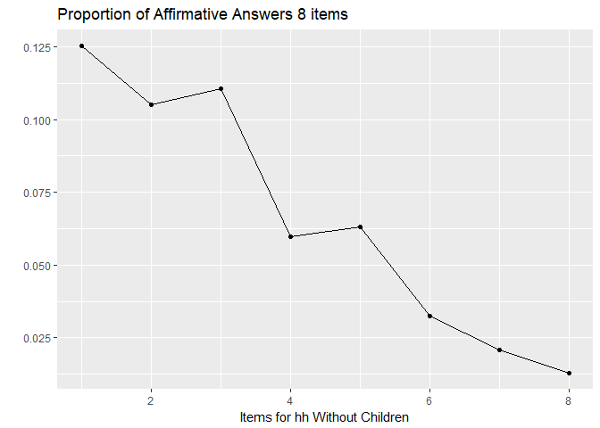
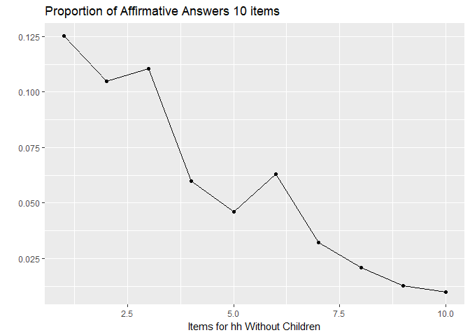
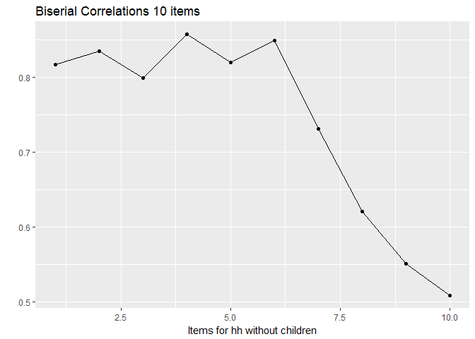
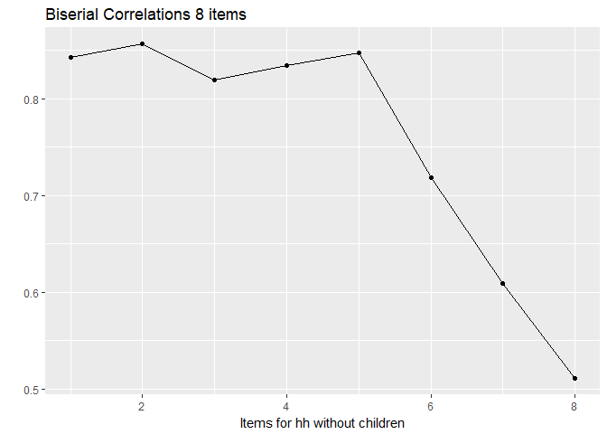
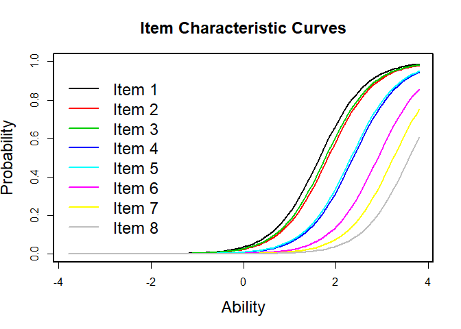
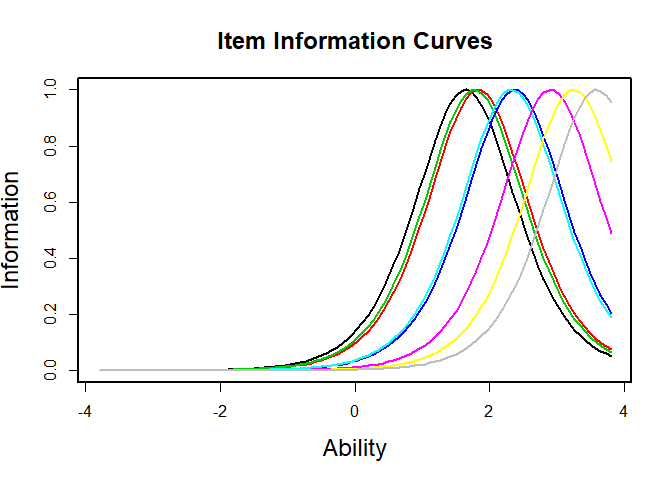
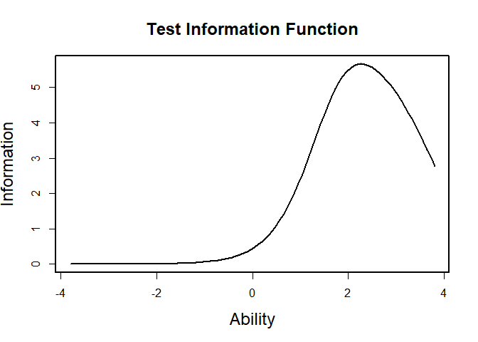
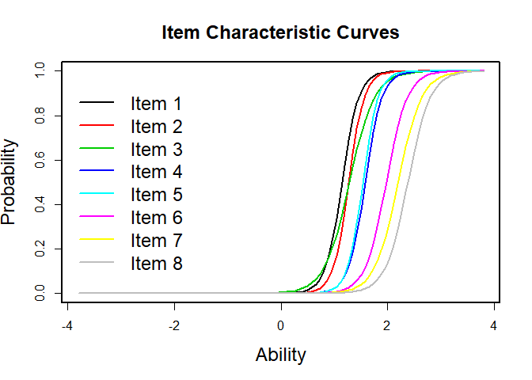
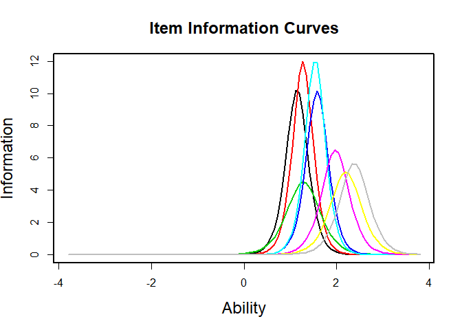
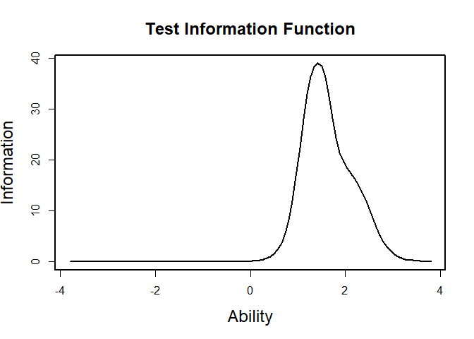

Analysis of HH Without Children
================
Martha Moreno
October 4 2017

Research Question:
==================

Fitting several IRT models on the Food Security Scale to assess:

1.  Which model has better fit between:
    1.  unconstrained Rasch Model
    2.  constrained Rasch Model
    3.  Two Parameter Logistic Model

2.  Can we obtain significantly different cut-off points using the best model?

3.  If the model shows a good fit, do we have parameter invariance between Mexico´s and U.S. scales?

Food Security Scale
-------------------

Data from the Current Population Survey - December of 2016

How is the survey conducted:
----------------------------

### screening question - not used for food security measure

q1=hess1

### stage 1

q2=hess2

q3=hess3

q4=hess4

if there are children &lt;18 ask q5 and q6

q5=hess5

q6=hess6

1st-level Screen (screener for Stage 2): If AFFIRMATIVE RESPONSE to ANY ONE of Questions 2-6 (i.e., "often true" or "sometimes true") OR response \[3\] or \[4\] to Question 1 (if administered), then continue to Stage 2; otherwise, skip to end.

### stage 2

q7=hesh1

q8=hesh2

q8a=heshf2

q9=hesh3

q10=hesh4

q11=hesh5

2nd-level Screen (screener for Stage 3): If AFFIRMATIVE RESPONSE to ANY ONE of Questions 7 through 11, then continue to Stage 3; otherwise, skip to end.

### stage 3

q12=hessh1

q12a=hesshf1

q13=hessh2

q14=hessh4

q14a=hesshf4

q15=hessh3

q16=hessh5

``` r
dat<-read.dta("data/data_clean_nochild.dta")

items1=cbind(dat$i2, dat$i3, dat$i4, dat$i8, dat$i8a, dat$i9, dat$i10, dat$i11, dat$i12, dat$i12a)
items2=cbind(dat$i2, dat$i3, dat$i4, dat$i8, dat$i9, dat$i10, dat$i11, dat$i12)

#Frequencies
freq1<-apply(items1,2,table)
freq2<-apply(items2,2,table)
freq1<-addmargins(freq1)
freq2<-addmargins(freq2)

#Means of affirmative answers
means1<-apply(items1,2,mean)
means2<-apply(items2,2,mean)

#Summary table of 10 items
table1<-rbind(round(freq1[1:3,1:10],0),round(means1*100,2))
nam1<-c("Item2", "Item3", "Item4", "Item8", "Item8a", "Item9", "Item10", "Item11", "Item12", "Item12a")
nam2<-c("No", "Yes", "Total", "Percentage")
colnames(table1)<-nam1
rownames(table1)<-nam2

#Summary table of 8 items
table2<-rbind(round(freq2[1:3,1:8],0),round(means2*100,2))
nam1<-c("Item2", "Item3", "Item4", "Item8", "Item9", "Item10", "Item11", "Item12")
nam2<-c("No", "Yes", "Total", "Percentage")
colnames(table2)<-nam1
rownames(table2)<-nam2

#Plots of affirmative answers for each item
means.plot1<-qplot(x=1:length(means1), y=means1, main="Proportion of Affirmative Answers 10 items", xlab="Items for hh Without Children", ylab="") + geom_line()
means.plot2<-qplot(x=1:length(means2), y=means2, main="Proportion of Affirmative Answers 8 items", xlab="Items for hh Without Children", ylab="") + geom_line()

#Using descript from ltm to get the biserial correlations:
d1<-descript(items1)
correlations1 <- d1$bisCorr
d2<-descript(items2)
correlations2 <- d2$bisCorr

#Biserial correlations plots
cor.plot1<-qplot(x=1:length(correlations1), y=correlations1, main="Biserial Correlations 10 items", xlab="Items for hh without children", ylab="") + geom_line()
cor.plot2<-qplot(x=1:length(correlations2), y=correlations2, main="Biserial Correlations 8 items", xlab="Items for hh without children", ylab="") + geom_line()

d1
```

    ## 
    ## Descriptive statistics for the 'items1' data-set
    ## 
    ## Sample:
    ##  10 items and 51487 sample units; 0 missing values
    ## 
    ## Proportions for each level of response:
    ##                       logit
    ##  [1,] 0.8747 0.1253 -1.9430
    ##  [2,] 0.8951 0.1049 -2.1435
    ##  [3,] 0.8893 0.1107 -2.0839
    ##  [4,] 0.9401 0.0599 -2.7540
    ##  [5,] 0.9539 0.0461 -3.0291
    ##  [6,] 0.9369 0.0631 -2.6975
    ##  [7,] 0.9677 0.0323 -3.3986
    ##  [8,] 0.9792 0.0208 -3.8517
    ##  [9,] 0.9871 0.0129 -4.3393
    ## [10,] 0.9901 0.0099 -4.6027
    ## 
    ## 
    ## Frequencies of total scores:
    ##          0    1    2    3   4   5   6   7   8   9  10
    ## Freq 43324 2005 1414 1386 663 583 712 573 386 169 272
    ## 
    ## 
    ## Point Biserial correlation with Total Score:
    ##       Included Excluded
    ##  [1,]   0.8168   0.7325
    ##  [2,]   0.8348   0.7647
    ##  [3,]   0.7989   0.7139
    ##  [4,]   0.8577   0.8128
    ##  [5,]   0.8199   0.7722
    ##  [6,]   0.8492   0.8004
    ##  [7,]   0.7314   0.6766
    ##  [8,]   0.6206   0.5644
    ##  [9,]   0.5511   0.5020
    ## [10,]   0.5086   0.4632
    ## 
    ## 
    ## Cronbach's alpha:
    ##                    value
    ## All Items         0.9026
    ## Excluding Item 1  0.8912
    ## Excluding Item 2  0.8865
    ## Excluding Item 3  0.8914
    ## Excluding Item 4  0.8824
    ## Excluding Item 5  0.8863
    ## Excluding Item 6  0.8831
    ## Excluding Item 7  0.8933
    ## Excluding Item 8  0.8999
    ## Excluding Item 9  0.9036
    ## Excluding Item 10 0.9054
    ## 
    ## 
    ## Pairwise Associations:
    ##    Item i Item j p.value
    ## 1       1      2  <2e-16
    ## 2       1      3  <2e-16
    ## 3       1      4  <2e-16
    ## 4       1      5  <2e-16
    ## 5       1      6  <2e-16
    ## 6       1      7  <2e-16
    ## 7       1      8  <2e-16
    ## 8       1      9  <2e-16
    ## 9       1     10  <2e-16
    ## 10      2      3  <2e-16

``` r
d2
```

    ## 
    ## Descriptive statistics for the 'items2' data-set
    ## 
    ## Sample:
    ##  8 items and 51487 sample units; 0 missing values
    ## 
    ## Proportions for each level of response:
    ##                      logit
    ## [1,] 0.8747 0.1253 -1.9430
    ## [2,] 0.8951 0.1049 -2.1435
    ## [3,] 0.8893 0.1107 -2.0839
    ## [4,] 0.9401 0.0599 -2.7540
    ## [5,] 0.9369 0.0631 -2.6975
    ## [6,] 0.9677 0.0323 -3.3986
    ## [7,] 0.9792 0.0208 -3.8517
    ## [8,] 0.9871 0.0129 -4.3393
    ## 
    ## 
    ## Frequencies of total scores:
    ##          0    1    2    3   4   5   6   7   8
    ## Freq 43324 2006 1468 1450 866 859 686 507 321
    ## 
    ## 
    ## Point Biserial correlation with Total Score:
    ##      Included Excluded
    ## [1,]   0.8423   0.7534
    ## [2,]   0.8566   0.7826
    ## [3,]   0.8194   0.7269
    ## [4,]   0.8339   0.7732
    ## [5,]   0.8476   0.7895
    ## [6,]   0.7186   0.6523
    ## [7,]   0.6094   0.5430
    ## [8,]   0.5112   0.4514
    ## 
    ## 
    ## Cronbach's alpha:
    ##                   value
    ## All Items        0.8895
    ## Excluding Item 1 0.8694
    ## Excluding Item 2 0.8636
    ## Excluding Item 3 0.8712
    ## Excluding Item 4 0.8651
    ## Excluding Item 5 0.8632
    ## Excluding Item 6 0.8794
    ## Excluding Item 7 0.8888
    ## Excluding Item 8 0.8952
    ## 
    ## 
    ## Pairwise Associations:
    ##    Item i Item j p.value
    ## 1       1      2  <2e-16
    ## 2       1      3  <2e-16
    ## 3       1      4  <2e-16
    ## 4       1      5  <2e-16
    ## 5       1      6  <2e-16
    ## 6       1      7  <2e-16
    ## 7       1      8  <2e-16
    ## 8       2      3  <2e-16
    ## 9       2      4  <2e-16
    ## 10      2      5  <2e-16

Descriptive analysis for households without children (8 items)
--------------------------------------------------------------

### Frequencies and means

``` r
table1
```

    ##               Item2    Item3    Item4    Item8   Item8a    Item9   Item10
    ## No         45035.00 46084.00 45789.00 48405.00 49112.00 48237.00 49822.00
    ## Yes         6452.00  5403.00  5698.00  3082.00  2375.00  3250.00  1665.00
    ## Total      51487.00 51487.00 51487.00 51487.00 51487.00 51487.00 51487.00
    ## Percentage    12.53    10.49    11.07     5.99     4.61     6.31     3.23
    ##              Item11   Item12  Item12a
    ## No         50416.00 50824.00 50976.00
    ## Yes         1071.00   663.00   511.00
    ## Total      51487.00 51487.00 51487.00
    ## Percentage     2.08     1.29     0.99

``` r
table2
```

    ##               Item2    Item3    Item4    Item8    Item9   Item10   Item11
    ## No         45035.00 46084.00 45789.00 48405.00 48237.00 49822.00 50416.00
    ## Yes         6452.00  5403.00  5698.00  3082.00  3250.00  1665.00  1071.00
    ## Total      51487.00 51487.00 51487.00 51487.00 51487.00 51487.00 51487.00
    ## Percentage    12.53    10.49    11.07     5.99     6.31     3.23     2.08
    ##              Item12
    ## No         50824.00
    ## Yes          663.00
    ## Total      51487.00
    ## Percentage     1.29

``` r
means.plot2
```



``` r
means.plot1
```



### Biserial correlations

``` r
correlations1
```

    ##  [1] 0.8167580 0.8348108 0.7989322 0.8577018 0.8198962 0.8491525 0.7313699
    ##  [8] 0.6205512 0.5511085 0.5086339

``` r
correlations2
```

    ## [1] 0.8422797 0.8565714 0.8194273 0.8339096 0.8475602 0.7185658 0.6094275
    ## [8] 0.5112280

``` r
cor.plot1
```



``` r
cor.plot2
```



Status of food security vs raw score
------------------------------------

``` r
CrossTable(dat$rawscore,dat$status, expected = F, prop.r=F, prop.c=F, prop.t=F, prop.chisq=F, chisq = F, fisher=F, mcnemar=F, resid=F, sresid=F, asresid=F)
```

    ## 
    ##  
    ##    Cell Contents
    ## |-------------------------|
    ## |                       N |
    ## |-------------------------|
    ## 
    ##  
    ## Total Observations in Table:  51487 
    ## 
    ##  
    ##              | dat$status 
    ## dat$rawscore |     High Food Security | Marginal Food Security |      Low Food Security | Very Low Food Security |              Row Total | 
    ## -------------|------------------------|------------------------|------------------------|------------------------|------------------------|
    ##            0 |                  43324 |                      0 |                      0 |                      0 |                  43324 | 
    ## -------------|------------------------|------------------------|------------------------|------------------------|------------------------|
    ##            1 |                      0 |                   1995 |                      0 |                      0 |                   1995 | 
    ## -------------|------------------------|------------------------|------------------------|------------------------|------------------------|
    ##            2 |                      0 |                   1417 |                      0 |                      0 |                   1417 | 
    ## -------------|------------------------|------------------------|------------------------|------------------------|------------------------|
    ##            3 |                      0 |                      0 |                   1387 |                      0 |                   1387 | 
    ## -------------|------------------------|------------------------|------------------------|------------------------|------------------------|
    ##            4 |                      0 |                      0 |                    661 |                      0 |                    661 | 
    ## -------------|------------------------|------------------------|------------------------|------------------------|------------------------|
    ##            5 |                      0 |                      0 |                    578 |                      0 |                    578 | 
    ## -------------|------------------------|------------------------|------------------------|------------------------|------------------------|
    ##            6 |                      0 |                      0 |                      0 |                    713 |                    713 | 
    ## -------------|------------------------|------------------------|------------------------|------------------------|------------------------|
    ##            7 |                      0 |                      0 |                      0 |                    579 |                    579 | 
    ## -------------|------------------------|------------------------|------------------------|------------------------|------------------------|
    ##            8 |                      0 |                      0 |                      0 |                    387 |                    387 | 
    ## -------------|------------------------|------------------------|------------------------|------------------------|------------------------|
    ##            9 |                      0 |                      0 |                      0 |                    164 |                    164 | 
    ## -------------|------------------------|------------------------|------------------------|------------------------|------------------------|
    ##           10 |                      0 |                      0 |                      0 |                    282 |                    282 | 
    ## -------------|------------------------|------------------------|------------------------|------------------------|------------------------|
    ## Column Total |                  43324 |                   3412 |                   2626 |                   2125 |                  51487 | 
    ## -------------|------------------------|------------------------|------------------------|------------------------|------------------------|
    ## 
    ## 

Testing several models just using the 8 items (no follow ups)
-------------------------------------------------------------

1.  Fit a Rasch Model. Rasch models are also known as one parameter models. It assumes that the guessing and the discrimination parameter are the same across items:

In this case we are fitting an unconstrained and a constrained Rasch Model with:

*α*<sub>*i*</sub> = 2 ∀*i*

*c*<sub>*i*</sub> = 0 ∀*i*

1.  Fit a Two Parameter Model, in this case the model estimates the discrimination parameter for each item, but *c*<sub>*i*</sub> = 0 ∀*i*

### Rasch Model

``` r
#Fit a Rasch model - hessian matrix is non-positive!!!
fit.rasch<-rasch(items2)
```

    ## Warning in rasch(items2): Hessian matrix at convergence is not positive definite; unstable solution.

``` r
summary(fit.rasch)
```

    ## Warning in sqrt(diag(new.covar)): Se han producido NaNs

    ## Warning in sqrt(diag(new.covar)): Se han producido NaNs

    ## Warning in sqrt(diag(new.covar)): Se han producido NaNs

    ## Warning in sqrt(diag(new.covar)): Se han producido NaNs

    ## Warning in sqrt(diag(new.covar)): Se han producido NaNs

    ## Warning in sqrt(diag(new.covar)): Se han producido NaNs

    ## Warning in sqrt(diag(new.covar)): Se han producido NaNs

    ## Warning in sqrt(diag(new.covar)): Se han producido NaNs

    ## Warning in sqrt(Var[n.ind + 1, n.ind + 1]): Se han producido NaNs

    ## 
    ## Call:
    ## rasch(data = items2)
    ## 
    ## Model Summary:
    ##   log.Lik      AIC      BIC
    ##  -85823.8 171665.6 171745.2
    ## 
    ## Coefficients:
    ##                 value std.err z.vals
    ## Dffclt.Item 1 -0.0379     NaN    NaN
    ## Dffclt.Item 2 -0.0172     NaN    NaN
    ## Dffclt.Item 3 -0.0226     NaN    NaN
    ## Dffclt.Item 4  0.0229     NaN    NaN
    ## Dffclt.Item 5  0.0198     NaN    NaN
    ## Dffclt.Item 6  0.0555     NaN    NaN
    ## Dffclt.Item 7  0.0783     NaN    NaN
    ## Dffclt.Item 8  0.1070     NaN    NaN
    ## Dscrmn        29.2396     NaN    NaN
    ## 
    ## Integration:
    ## method: Gauss-Hermite
    ## quadrature points: 21 
    ## 
    ## Optimization:
    ## Convergence: 0 
    ## max(|grad|): 0.08 
    ## quasi-Newton: BFGS

``` r
#Constraint? - this fits better?
fit.rasch<-rasch(items2, constraint=cbind(9,2))
summary(fit.rasch)
```

    ## 
    ## Call:
    ## rasch(data = items2, constraint = cbind(9, 2))
    ## 
    ## Model Summary:
    ##   log.Lik      AIC      BIC
    ##  -58135.9 116287.8 116358.6
    ## 
    ## Coefficients:
    ##                value std.err   z.vals
    ## Dffclt.Item 1 1.6428  0.0105 156.7264
    ## Dffclt.Item 2 1.8258  0.0112 163.0228
    ## Dffclt.Item 3 1.7715  0.0110 161.3499
    ## Dffclt.Item 4 2.3721  0.0138 171.8568
    ## Dffclt.Item 5 2.3228  0.0135 171.5996
    ## Dffclt.Item 6 2.9052  0.0173 168.3603
    ## Dffclt.Item 7 3.2459  0.0203 159.9781
    ## Dffclt.Item 8 3.5837  0.0243 147.3497
    ## Dscrmn        2.0000      NA       NA
    ## 
    ## Integration:
    ## method: Gauss-Hermite
    ## quadrature points: 21 
    ## 
    ## Optimization:
    ## Convergence: 0 
    ## max(|grad|): 0.064 
    ## quasi-Newton: BFGS

``` r
#Margins?? - we don´t want´t the chi-square to be significant
margins(fit.rasch)
```

    ## 
    ## Call:
    ## rasch(data = items2, constraint = cbind(9, 2))
    ## 
    ## Fit on the Two-Way Margins
    ## 
    ## Response: (0,0)
    ##   Item i Item j   Obs      Exp (O-E)^2/E    
    ## 1      1      2 44452 43219.57     35.14 ***
    ## 2      5      8 48178 49138.88     18.79 ***
    ## 3      4      8 48359 49292.12     17.66 ***
    ## 
    ## Response: (1,0)
    ##   Item i Item j  Obs     Exp (O-E)^2/E    
    ## 1      1      2 1632 3850.85   1278.49 ***
    ## 2      2      3 1430 2858.27    713.70 ***
    ## 3      1      3 2123 3755.76    709.82 ***
    ## 
    ## Response: (0,1)
    ##   Item i Item j  Obs     Exp (O-E)^2/E    
    ## 1      1      2  583 2670.48   1631.75 ***
    ## 2      1      3 1369 2903.72    811.16 ***
    ## 3      1      5  282 1179.77    683.18 ***
    ## 
    ## Response: (1,1)
    ##   Item i Item j  Obs    Exp (O-E)^2/E    
    ## 1      4      5 2483 507.64   7686.73 ***
    ## 2      6      7  791  85.27   5840.53 ***
    ## 3      4      6 1446 247.11   5816.61 ***
    ## 
    ## '***' denotes a chi-squared residual greater than 3.5

``` r
margins(fit.rasch, type="three-way")
```

    ## 
    ## Call:
    ## rasch(data = items2, constraint = cbind(9, 2))
    ## 
    ## Fit on the Three-Way Margins
    ## 
    ## Response: (0,0,0)
    ##   Item i Item j Item k   Obs      Exp (O-E)^2/E    
    ## 1      1      2      3 43341 40955.83    138.91 ***
    ## 2      1      2      5 44297 42343.60     90.11 ***
    ## 3      1      2      4 44278 42418.53     81.51 ***
    ## 
    ## Response: (1,0,0)
    ##   Item i Item j Item k  Obs     Exp (O-E)^2/E    
    ## 1      1      2      4 1346 3444.22   1278.23 ***
    ## 2      1      2      7 1585 3758.66   1257.04 ***
    ## 3      1      2      6 1535 3681.16   1251.24 ***
    ## 
    ## Response: (0,1,0)
    ##   Item i Item j Item k Obs     Exp (O-E)^2/E    
    ## 1      1      2      8 562 2636.50   1632.30 ***
    ## 2      1      2      7 548 2606.55   1625.76 ***
    ## 3      1      2      6 543 2552.80   1582.30 ***
    ## 
    ## Response: (1,1,0)
    ##   Item i Item j Item k  Obs     Exp (O-E)^2/E    
    ## 1      4      5      8 1914  456.80   4648.41 ***
    ## 2      1      2      8 4197 1648.36   3940.64 ***
    ## 3      1      2      7 3861 1577.92   3303.36 ***
    ## 
    ## Response: (0,0,1)
    ##   Item i Item j Item k Obs     Exp (O-E)^2/E    
    ## 1      1      4      5 106 1030.38    829.28 ***
    ## 2      2      4      5 171 1133.07    816.88 ***
    ## 3      3      4      5 179 1103.24    774.28 ***
    ## 
    ## Response: (1,0,1)
    ##   Item i Item j Item k Obs   Exp (O-E)^2/E    
    ## 1      6      7      8 151 35.25    380.06 ***
    ## 2      4      7      8 212 65.02    332.25 ***
    ## 3      5      7      8 202 68.27    261.95 ***
    ## 
    ## Response: (0,1,1)
    ##   Item i Item j Item k Obs    Exp (O-E)^2/E    
    ## 1      1      2      3 258 639.98    227.99 ***
    ## 2      3      7      8  36   5.66    162.55 ***
    ## 3      1      2      4 107 281.99    108.59 ***
    ## 
    ## Response: (1,1,1)
    ##   Item i Item j Item k  Obs    Exp (O-E)^2/E    
    ## 1      4      5      6 1361 128.98  11767.80 ***
    ## 2      2      4      5 2218 326.65  10951.16 ***
    ## 3      1      4      5 2307 358.24  10600.76 ***
    ## 
    ## '***' denotes a chi-squared residual greater than 3.5

``` r
#Goodness of fit cannot be computed with unconstrained model??
#GoF.rasch(fit.rasch, B = 100)

#Residuals
#plot residuals vs ability to test homoscedasticity??
res.rasch<-residuals(fit.rasch)

#Factor scores
fs.rasch<-factor.scores(fit.rasch)
#plot(fs.rasch)

#ICC and information curves
par(lwd=2)
plot(fit.rasch, legend = TRUE, cx = "left", cex.main = 1.5, cex.lab = 1.5, cex = 1.5)
```



``` r
plot(fit.rasch, type = "IIC", annot = FALSE, cex.main = 1.5, cex.lab = 1.5)
```



``` r
plot(fit.rasch, type = "IIC", items = 0, cex.main = 1.5, cex.lab = 1.5)
```



### 2PL Model

``` r
#Fit a 2PL model - up to two latent variables with names z1 and z2
fit.2pl<-ltm(items2~z1, IRT.param = T)
summary(fit.2pl)
```

    ## 
    ## Call:
    ## ltm(formula = items2 ~ z1, IRT.param = T)
    ## 
    ## Model Summary:
    ##    log.Lik      AIC      BIC
    ##  -50684.74 101401.5 101543.1
    ## 
    ## Coefficients:
    ##                value std.err   z.vals
    ## Dffclt.Item 1 1.1420  0.0063 180.7721
    ## Dffclt.Item 2 1.2680  0.0058 220.0335
    ## Dffclt.Item 3 1.2799  0.0074 172.7036
    ## Dffclt.Item 4 1.5771  0.0096 163.6463
    ## Dffclt.Item 5 1.5332  0.0088 174.1432
    ## Dffclt.Item 6 1.9717  0.0101 196.1443
    ## Dffclt.Item 7 2.1953  0.0141 155.6463
    ## Dffclt.Item 8 2.3785  0.0227 104.9877
    ## Dscrmn.Item 1 6.4122  0.1166  54.9751
    ## Dscrmn.Item 2 6.9172  0.1699  40.7130
    ## Dscrmn.Item 3 4.2509  0.0662  64.2516
    ## Dscrmn.Item 4 6.3673  0.1770  35.9675
    ## Dscrmn.Item 5 6.9613  0.2135  32.6071
    ## Dscrmn.Item 6 5.0929  0.1205  42.2680
    ## Dscrmn.Item 7 4.5372  0.1419  31.9830
    ## Dscrmn.Item 8 4.7590  0.2235  21.2895
    ## 
    ## Integration:
    ## method: Gauss-Hermite
    ## quadrature points: 21 
    ## 
    ## Optimization:
    ## Convergence: 0 
    ## max(|grad|): 1.4 
    ## quasi-Newton: BFGS

``` r
#Margins - is this due to sample size??
margins(fit.2pl)
```

    ## 
    ## Call:
    ## ltm(formula = items2 ~ z1, IRT.param = T)
    ## 
    ## Fit on the Two-Way Margins
    ## 
    ## Response: (0,0)
    ##   Item i Item j   Obs      Exp (O-E)^2/E    
    ## 1      1      2 44452 43446.19     23.29 ***
    ## 2      2      3 44359 43559.55     14.67 ***
    ## 3      1      3 43666 42880.18     14.40 ***
    ## 
    ## Response: (1,0)
    ##   Item i Item j  Obs     Exp (O-E)^2/E    
    ## 1      4      5  599  942.38    125.12 ***
    ## 2      1      2 1632 2096.04    102.73 ***
    ## 3      1      6 4877 5538.64     79.04 ***
    ## 
    ## Response: (0,1)
    ##   Item i Item j Obs     Exp (O-E)^2/E    
    ## 1      4      5 767 1136.77    120.28 ***
    ## 2      1      2 583  906.41    115.40 ***
    ## 3      3      5 451  624.43     48.17 ***
    ## 
    ## Response: (1,1)
    ##   Item i Item j  Obs     Exp (O-E)^2/E    
    ## 1      1      3 4329 4700.09     29.30 ***
    ## 2      4      5 2483 2248.62     24.43 ***
    ## 3      6      7  791  700.04     11.82 ***
    ## 
    ## '***' denotes a chi-squared residual greater than 3.5

``` r
margins(fit.2pl, type="three-way")
```

    ## 
    ## Call:
    ## ltm(formula = items2 ~ z1, IRT.param = T)
    ## 
    ## Fit on the Three-Way Margins
    ## 
    ## Response: (0,0,0)
    ##   Item i Item j Item k   Obs      Exp (O-E)^2/E    
    ## 1      1      2      8 44443 43439.86     23.17 ***
    ## 2      1      2      7 44422 43426.42     22.82 ***
    ## 3      1      2      6 44402 43415.02     22.44 ***
    ## 
    ## Response: (1,0,0)
    ##   Item i Item j Item k Obs    Exp (O-E)^2/E    
    ## 1      4      5      8 551 927.90    153.09 ***
    ## 2      4      5      6 514 879.04    151.59 ***
    ## 3      4      5      7 541 908.08    148.39 ***
    ## 
    ## Response: (0,1,0)
    ##   Item i Item j Item k Obs     Exp (O-E)^2/E    
    ## 1      4      5      6 646 1045.01    152.35 ***
    ## 2      4      5      7 693 1086.60    142.57 ***
    ## 3      3      4      5 163  393.82    135.29 ***
    ## 
    ## Response: (1,1,0)
    ##   Item i Item j Item k  Obs     Exp (O-E)^2/E    
    ## 1      1      4      5  494  736.55     79.87 ***
    ## 2      2      4      5  404  607.94     68.41 ***
    ## 3      1      3      5 1759 2094.86     53.85 ***
    ## 
    ## Response: (0,0,1)
    ##   Item i Item j Item k Obs    Exp (O-E)^2/E    
    ## 1      3      4      5 179 457.20    169.28 ***
    ## 2      2      4      5 171 384.69    118.70 ***
    ## 3      1      4      5 106 231.66     68.16 ***
    ## 
    ## Response: (1,0,1)
    ##   Item i Item j Item k Obs    Exp (O-E)^2/E    
    ## 1      1      2      3 614 950.55    119.16 ***
    ## 2      4      5      8  48  14.48     77.62 ***
    ## 3      1      4      5 661 905.12     65.84 ***
    ## 
    ## Response: (0,1,1)
    ##   Item i Item j Item k Obs  Exp (O-E)^2/E    
    ## 1      1      7      8  17 0.51    536.68 ***
    ## 2      1      6      7  33 2.12    450.59 ***
    ## 3      1      6      8  21 0.91    441.19 ***
    ## 
    ## Response: (1,1,1)
    ##   Item i Item j Item k  Obs     Exp (O-E)^2/E    
    ## 1      3      4      5 2211 2081.39      8.07 ***
    ## 2      5      6      7  753  686.41      6.46 ***
    ## 3      1      4      5 2307 2192.61      5.97 ***
    ## 
    ## '***' denotes a chi-squared residual greater than 3.5

``` r
#Compare the fit of the Rasch Model vs the 2PL Model - is this a better fit??
anova(fit.rasch, fit.2pl)
```

    ## 
    ##  Likelihood Ratio Table
    ##                AIC      BIC   log.Lik      LRT df p.value
    ## fit.rasch 116287.8 116358.6 -58135.90                    
    ## fit.2pl   101401.5 101543.1 -50684.74 14902.32  8  <0.001

``` r
#Residuals
#plot residuals vs ability to test homoscedasticity??
res.2pl<-residuals(fit.2pl)

#Factor scores - is the lack of a normal distribution here a problem??
fs.2pl<-factor.scores(fit.2pl)
#plot(fs.2pl)

#ICC and informaction curves
par(lwd=2)
plot(fit.2pl, legend = TRUE, cx = "left", cex.main = 1.5, cex.lab = 1.5, cex = 1.5)
```



``` r
plot(fit.2pl, type = "IIC", annot = FALSE, cex.main = 1.5, cex.lab = 1.5)
```



``` r
plot(fit.2pl, type = "IIC", items = 0, cex.main = 1.5, cex.lab = 1.5)
```


