Analysis of HH Without Children
================
Martha Moreno
October 4 2017

Research Question:
==================

Fitting several IRT models on the Food Security Scale to assess:

1.  Which model has better fit between:
    1.  unconstrained Rasch Model
    2.  constrained Rasch Model
    3.  Two Parameter Logistic Model

2.  Can we obtain significantly different cut-off points using the best model?

3.  If the model shows a good fit, do we have parameter invariance between Mexico´s and U.S. scales?

Food Security Scale
-------------------

Data from the Current Population Survey - December of 2016

How is the survey conducted?
----------------------------

#### Screening question - not used for food security measure and so not used for this analysis:

-   HESS1 = i1

Which of these statements best describes the food eaten in your household in the last 12 months: we always have enough to eat and the kinds of food we want; we have enough to eat but not always the kinds of food we want; sometimes we don't have enough to eat; or often we don't have enough to eat?

------------------------------------------------------------------------

#### Stage 1

-   HESS2 = i2

Scale12 - worried food would run out, past 12 months

With the following Ranges:

-9 No response

-3 Refused

-2 Don't Know

1 Often true

2 Sometimes true

3 Never true

------------------------------------------------------------------------

-   HESS3 = i3

Scale12 - food bought didn't last, past 12 months

With the following Ranges:

-9 No response

-3 Refused

-2 Don't Know

1 Often true

2 Sometimes true

3 Never true

------------------------------------------------------------------------

-   HESS4 = i4

Scale12 - couldn't afford balanced meals, past 12 months

With the following Ranges:

-9 No response

-3 Refused

-2 Don't Know

1 Often true

2 Sometimes true

3 Never true

------------------------------------------------------------------------

#### If there are children &lt;18 ask q5 and q6

-   HESS5 = i5

Scale12 - child fed few kinds of low-cost foods, past 12 months With the following Ranges:

-9 No response

-3 Refused

-2 Don't Know

1 Often true

2 Sometimes true

3 Never true

------------------------------------------------------------------------

-   HESS6 = i6

Scale12 - couldn't feed child balanced meals, past 12 months With the following Ranges:

-9 No response

-3 Refused

-2 Don't Know

1 Often true

2 Sometimes true

3 Never true

------------------------------------------------------------------------

#### 1st-level Screen (screener for Stage 2): If AFFIRMATIVE RESPONSE to ANY ONE of Questions 2-6 (i.e., "often true" or "sometimes true") OR response \[3\] or \[4\] to Question 1 (if administered), then continue to Stage 2; otherwise, skip to end.

#### stage 2

-   HESH1 = i7

Scale12 - child not eating enough, past 12 months

With the following Ranges:

-9 No response

-3 Refused

-2 Don't Know

1 Often true

2 Sometimes true

3 Never true

------------------------------------------------------------------------

-   HESH2 = i8

Scale12 - adult cut size or skipped meals, past 12 montths With the following Ranges:

-9 No response

-3 Refused

-2 Don't Know

1 Yes

2 No

------------------------------------------------------------------------

-   HESHF2 = i8a

Scale12 - frequency adult cut or skipped, past 12 mon With the following Ranges:

-9 No response

-3 Refused

-2 Don't Know

1 Almost every month

2 Some months but not every month

3 Only 1 or 2 months

------------------------------------------------------------------------

-   HESH3 = i9

Scale12 - ate less than felt they should, past 12 months

With the following Ranges:

-9 No response

-3 Refused

-2 Don't Know

1 Yes

2 No

------------------------------------------------------------------------

-   HESH4 = i10

Scale 12 - respondent hungry but didn't eat, past 12 months

With the following Ranges:

-9 No response

-3 Refused

-2 Don't Know

1 Yes

2 No

------------------------------------------------------------------------

-   HESH5 = i11

Scale12 - respondent lost weight, past 12 months With the following Ranges:

-9 No response

-3 Refused

-2 Don't Know

1 Yes

2 No

------------------------------------------------------------------------

#### 2nd-level Screen (screener for Stage 3): If AFFIRMATIVE RESPONSE to ANY ONE of Questions 7 through 11, then continue to Stage 3; otherwise, skip to end.

#### Stage 3

-   HESSH1 = i12

Scale12 - adult not eat whole day, past 12 months With the following Ranges:

-9 No response

-3 Refused

-2 Don't Know

1 Yes

2 No

------------------------------------------------------------------------

-   HESSHF1 = i12a

Scale12 - frequency adult not eat whole day, past 12 months With the following Ranges:

-9 No response

-3 Refused

-2 Don't Know

1 Almost every month

2 Some months but not every month

3 Only 1 or 2 months

------------------------------------------------------------------------

-   HESSH2 = i13 Scale12 - cut size of child's meals, past 12 months With the following Ranges:

-9 No response

-3 Refused

-2 Don't Know

1 Yes

2 No

------------------------------------------------------------------------

-   HESSH4 = i14

Scale12 - child skipped meal, past 12 months With the following Ranges:

-9 No response

-3 Refused

-2 Don't Know

1 Yes

2 No
----

-   HESSHF4 = i14a

Scale12 - frequency child skipped meal, past 12 months With the following Ranges:

-9 No response

-3 Refused

-2 Don't Know

1 Almost every month

2 Some months but not every month

3 Only 1 or 2 months

------------------------------------------------------------------------

-   HESSH3 = i15

Scale12 - child hungry - past 12 months With the following Ranges:

-9 No response

-3 Refused

-2 Don't Know

1 Yes

2 No

------------------------------------------------------------------------

-   HESSH5 = i16

Scale12 - child didn't eat whole day, past 12 months With the following Ranges:

-9 No response

-3 Refused

-2 Don't Know

1 Yes

2 No

------------------------------------------------------------------------

#### Some considerations about the data:

-   For the often true/sometimes true/never true items, they are recorded as follows:

recoded as 1 if "Often true" or "Sometimes true" and 0 if "Never true"

-   For the yes/no items, they are recorded as follows:

recoded as 1 if "Yes" and 0 if "No"

-   For the almost every month/some months but not every month/only 1 or 2 months items they were recoded as follows:

recoded as 1 if "every month" or "some months but not every month" and 0 if "only 1 or 2 months"

-   The rawscore that comes along the data set from the survey does not match my generated rawscore in 264 cases, I decided to exclude these cases from the analyisis until I figure out what´s going on here.

-   The households with no information are also excluded from the analysis (29,192 cases ehich represent 22.6% of the whole sample)

``` r
dat<-read.dta("data/data_clean_nochild.dta")

items1=cbind(dat$i2, dat$i3, dat$i4, dat$i8, dat$i8a, dat$i9, dat$i10, dat$i11, dat$i12, dat$i12a)
items2=cbind(dat$i2, dat$i3, dat$i4, dat$i8, dat$i9, dat$i10, dat$i11, dat$i12)

#Frequencies
freq1<-apply(items1,2,table)
freq2<-apply(items2,2,table)
freq1<-addmargins(freq1)
freq2<-addmargins(freq2)

#Means of affirmative answers
means1<-apply(items1,2,mean)
means2<-apply(items2,2,mean)

#Summary table of 10 items
table1<-rbind(round(freq1[1:3,1:10],0),round(means1*100,2))
nam1<-c("Item2", "Item3", "Item4", "Item8", "Item8a", "Item9", "Item10", "Item11", "Item12", "Item12a")
nam2<-c("No", "Yes", "Total", "Percentage")
colnames(table1)<-nam1
rownames(table1)<-nam2

#Summary table of 8 items
table2<-rbind(round(freq2[1:3,1:8],0),round(means2*100,2))
nam1<-c("Item2", "Item3", "Item4", "Item8", "Item9", "Item10", "Item11", "Item12")
nam2<-c("No", "Yes", "Total", "Percentage")
colnames(table2)<-nam1
rownames(table2)<-nam2
colnames(items2)<-nam1

#Plots of affirmative answers for each item
means.plot1<-qplot(x=1:length(means1), y=means1, main="Proportion of Affirmative Answers 10 items", xlab="Items for hh Without Children", ylab="") + geom_line()
means.plot2<-qplot(x=1:length(means2), y=means2, main="Proportion of Affirmative Answers 8 items", xlab="Items for hh Without Children", ylab="") + geom_line()

#Using descript from ltm to get the biserial correlations:
d1<-descript(items1)
correlations1 <- d1$bisCorr
d2<-descript(items2)
correlations2 <- d2$bisCorr

#Biserial correlations plots
cor.plot1<-qplot(x=1:length(correlations1), y=correlations1, main="Biserial Correlations 10 items", xlab="Items for hh without children", ylab="") + geom_line()
cor.plot2<-qplot(x=1:length(correlations2), y=correlations2, main="Biserial Correlations 8 items", xlab="Items for hh without children", ylab="") + geom_line()

d1
```

    ## 
    ## Descriptive statistics for the 'items1' data-set
    ## 
    ## Sample:
    ##  10 items and 51421 sample units; 0 missing values
    ## 
    ## Proportions for each level of response:
    ##                       logit
    ##  [1,] 0.8755 0.1245 -1.9508
    ##  [2,] 0.8959 0.1041 -2.1525
    ##  [3,] 0.8902 0.1098 -2.0928
    ##  [4,] 0.9409 0.0591 -2.7672
    ##  [5,] 0.9543 0.0457 -3.0397
    ##  [6,] 0.9376 0.0624 -2.7090
    ##  [7,] 0.9683 0.0317 -3.4199
    ##  [8,] 0.9793 0.0207 -3.8590
    ##  [9,] 0.9874 0.0126 -4.3628
    ## [10,] 0.9903 0.0097 -4.6234
    ## 
    ## 
    ## Frequencies of total scores:
    ##          0    1    2    3   4   5   6   7   8   9  10
    ## Freq 43324 1995 1411 1380 656 573 701 567 383 159 272
    ## 
    ## 
    ## Point Biserial correlation with Total Score:
    ##       Included Excluded
    ##  [1,]   0.8162   0.7314
    ##  [2,]   0.8347   0.7644
    ##  [3,]   0.7984   0.7130
    ##  [4,]   0.8569   0.8117
    ##  [5,]   0.8209   0.7734
    ##  [6,]   0.8489   0.8001
    ##  [7,]   0.7308   0.6763
    ##  [8,]   0.6229   0.5668
    ##  [9,]   0.5485   0.4996
    ## [10,]   0.5068   0.4615
    ## 
    ## 
    ## Cronbach's alpha:
    ##                    value
    ## All Items         0.9023
    ## Excluding Item 1  0.8909
    ## Excluding Item 2  0.8861
    ## Excluding Item 3  0.8911
    ## Excluding Item 4  0.8821
    ## Excluding Item 5  0.8858
    ## Excluding Item 6  0.8826
    ## Excluding Item 7  0.8929
    ## Excluding Item 8  0.8994
    ## Excluding Item 9  0.9033
    ## Excluding Item 10 0.9051
    ## 
    ## 
    ## Pairwise Associations:
    ##    Item i Item j p.value
    ## 1       1      2  <2e-16
    ## 2       1      3  <2e-16
    ## 3       1      4  <2e-16
    ## 4       1      5  <2e-16
    ## 5       1      6  <2e-16
    ## 6       1      7  <2e-16
    ## 7       1      8  <2e-16
    ## 8       1      9  <2e-16
    ## 9       1     10  <2e-16
    ## 10      2      3  <2e-16

``` r
d2
```

    ## 
    ## Descriptive statistics for the 'items2' data-set
    ## 
    ## Sample:
    ##  8 items and 51421 sample units; 0 missing values
    ## 
    ## Proportions for each level of response:
    ##                        logit
    ## Item2  0.8755 0.1245 -1.9508
    ## Item3  0.8959 0.1041 -2.1525
    ## Item4  0.8902 0.1098 -2.0928
    ## Item8  0.9409 0.0591 -2.7672
    ## Item9  0.9376 0.0624 -2.7090
    ## Item10 0.9683 0.0317 -3.4199
    ## Item11 0.9793 0.0207 -3.8590
    ## Item12 0.9874 0.0126 -4.3628
    ## 
    ## 
    ## Frequencies of total scores:
    ##          0    1    2    3   4   5   6   7   8
    ## Freq 43324 1996 1465 1444 849 855 675 495 318
    ## 
    ## 
    ## Point Biserial correlation with Total Score:
    ##        Included Excluded
    ## Item2    0.8419   0.7526
    ## Item3    0.8565   0.7823
    ## Item4    0.8191   0.7261
    ## Item8    0.8329   0.7720
    ## Item9    0.8471   0.7888
    ## Item10   0.7174   0.6513
    ## Item11   0.6113   0.5449
    ## Item12   0.5087   0.4491
    ## 
    ## 
    ## Cronbach's alpha:
    ##                   value
    ## All Items        0.8890
    ## Excluding Item2  0.8689
    ## Excluding Item3  0.8630
    ## Excluding Item4  0.8707
    ## Excluding Item8  0.8646
    ## Excluding Item9  0.8626
    ## Excluding Item10 0.8790
    ## Excluding Item11 0.8881
    ## Excluding Item12 0.8949
    ## 
    ## 
    ## Pairwise Associations:
    ##    Item i Item j p.value
    ## 1       1      2  <2e-16
    ## 2       1      3  <2e-16
    ## 3       1      4  <2e-16
    ## 4       1      5  <2e-16
    ## 5       1      6  <2e-16
    ## 6       1      7  <2e-16
    ## 7       1      8  <2e-16
    ## 8       2      3  <2e-16
    ## 9       2      4  <2e-16
    ## 10      2      5  <2e-16

#### Descriptive analysis for households without children (8 items)

#### Frequencies and means

``` r
table1
```

    ##               Item2    Item3    Item4    Item8   Item8a    Item9   Item10
    ## No         45021.00 46068.00 45775.00 48381.00 49073.00 48210.00 49792.00
    ## Yes         6400.00  5353.00  5646.00  3040.00  2348.00  3211.00  1629.00
    ## Total      51421.00 51421.00 51421.00 51421.00 51421.00 51421.00 51421.00
    ## Percentage    12.45    10.41    10.98     5.91     4.57     6.24     3.17
    ##              Item11   Item12  Item12a
    ## No         50359.00 50774.00 50921.00
    ## Yes         1062.00   647.00   500.00
    ## Total      51421.00 51421.00 51421.00
    ## Percentage     2.07     1.26     0.97

``` r
table2
```

    ##               Item2    Item3    Item4    Item8    Item9   Item10   Item11
    ## No         45021.00 46068.00 45775.00 48381.00 48210.00 49792.00 50359.00
    ## Yes         6400.00  5353.00  5646.00  3040.00  3211.00  1629.00  1062.00
    ## Total      51421.00 51421.00 51421.00 51421.00 51421.00 51421.00 51421.00
    ## Percentage    12.45    10.41    10.98     5.91     6.24     3.17     2.07
    ##              Item12
    ## No         50774.00
    ## Yes          647.00
    ## Total      51421.00
    ## Percentage     1.26

``` r
means.plot2
```

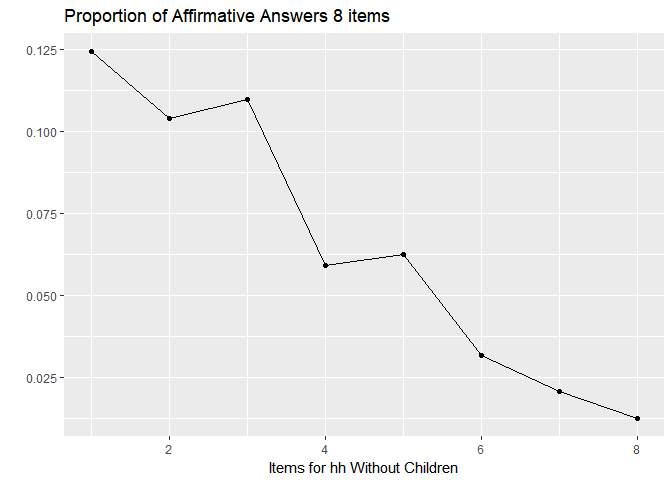

``` r
means.plot1
```

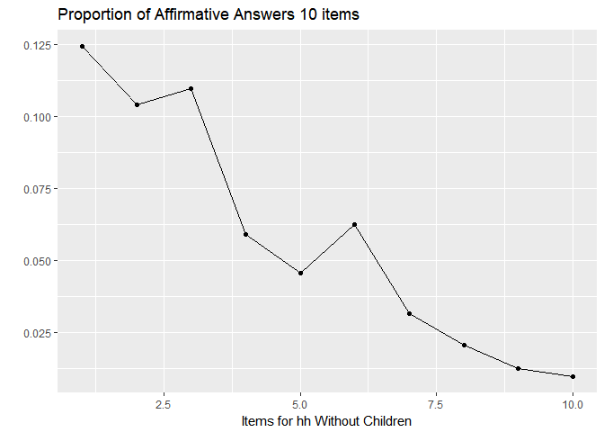

#### Biserial correlations

``` r
correlations1
```

    ##  [1] 0.8161911 0.8346679 0.7983635 0.8568655 0.8209200 0.8489323 0.7308402
    ##  [8] 0.6228612 0.5485162 0.5067987

``` r
correlations2
```

    ##     Item2     Item3     Item4     Item8     Item9    Item10    Item11 
    ## 0.8418779 0.8565321 0.8190801 0.8329211 0.8470797 0.7174211 0.6112603 
    ##    Item12 
    ## 0.5087288

``` r
cor.plot1
```

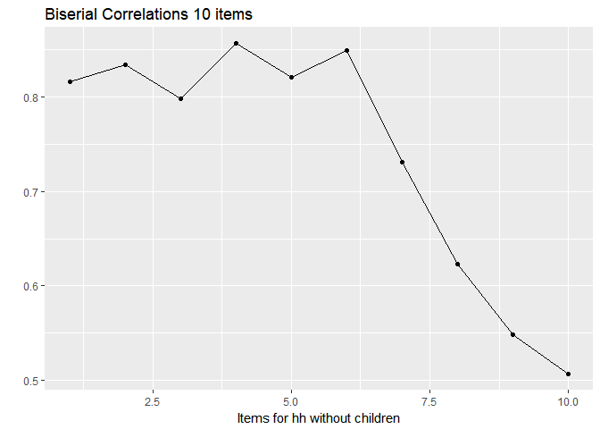

``` r
cor.plot2
```

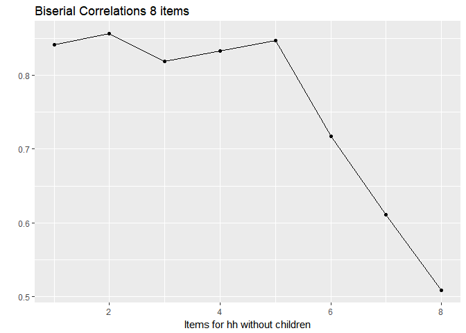

#### Status of food security vs raw score

``` r
CrossTable(dat$rawscore,dat$status, expected = F, prop.r=F, prop.c=F, prop.t=F, prop.chisq=F, chisq = F, fisher=F, mcnemar=F, resid=F, sresid=F, asresid=F)
```

    ## 
    ##  
    ##    Cell Contents
    ## |-------------------------|
    ## |                       N |
    ## |-------------------------|
    ## 
    ##  
    ## Total Observations in Table:  51421 
    ## 
    ##  
    ##              | dat$status 
    ## dat$rawscore |     High Food Security | Marginal Food Security |      Low Food Security | Very Low Food Security |              Row Total | 
    ## -------------|------------------------|------------------------|------------------------|------------------------|------------------------|
    ##            0 |                  43324 |                      0 |                      0 |                      0 |                  43324 | 
    ## -------------|------------------------|------------------------|------------------------|------------------------|------------------------|
    ##            1 |                      0 |                   1995 |                      0 |                      0 |                   1995 | 
    ## -------------|------------------------|------------------------|------------------------|------------------------|------------------------|
    ##            2 |                      0 |                   1411 |                      0 |                      0 |                   1411 | 
    ## -------------|------------------------|------------------------|------------------------|------------------------|------------------------|
    ##            3 |                      0 |                      0 |                   1380 |                      0 |                   1380 | 
    ## -------------|------------------------|------------------------|------------------------|------------------------|------------------------|
    ##            4 |                      0 |                      0 |                    656 |                      0 |                    656 | 
    ## -------------|------------------------|------------------------|------------------------|------------------------|------------------------|
    ##            5 |                      0 |                      0 |                    573 |                      0 |                    573 | 
    ## -------------|------------------------|------------------------|------------------------|------------------------|------------------------|
    ##            6 |                      0 |                      0 |                      0 |                    701 |                    701 | 
    ## -------------|------------------------|------------------------|------------------------|------------------------|------------------------|
    ##            7 |                      0 |                      0 |                      0 |                    567 |                    567 | 
    ## -------------|------------------------|------------------------|------------------------|------------------------|------------------------|
    ##            8 |                      0 |                      0 |                      0 |                    383 |                    383 | 
    ## -------------|------------------------|------------------------|------------------------|------------------------|------------------------|
    ##            9 |                      0 |                      0 |                      0 |                    159 |                    159 | 
    ## -------------|------------------------|------------------------|------------------------|------------------------|------------------------|
    ##           10 |                      0 |                      0 |                      0 |                    272 |                    272 | 
    ## -------------|------------------------|------------------------|------------------------|------------------------|------------------------|
    ## Column Total |                  43324 |                   3406 |                   2609 |                   2082 |                  51421 | 
    ## -------------|------------------------|------------------------|------------------------|------------------------|------------------------|
    ## 
    ## 

#### Testing several models just using the 8 items (no follow ups)

1.  Fit a Rasch Model. Rasch models are also known as one parameter models. It assumes that the guessing and the discrimination parameter are the same across items:

In this case we are fitting an unconstrained and a constrained Rasch Model with:

*α*<sub>*i*</sub> = 2 ∀*i* ??? - this was just for the graphs, but how do you establish it??

*c*<sub>*i*</sub> = 0 ∀*i*

1.  Fit a Two Parameter Model, in this case the model estimates the discrimination parameter for each item, but *c*<sub>*i*</sub> = 0 ∀*i*

#### Rasch Model

``` r
#Fit a Rasch model - hessian matrix is non-positive!!! None of these work
#fit.rasch<-rasch(items2)
#summary(fit.rasch)
#fit.rasch <- tpm(items2, type = "rasch", constraint = cbind(1:8, 3, 1))
#summary(fit.rasch)

#Constraint? - this fits better? In order to impose the constraint alpha, the constraint argument is used. This argument accepts a two-column matrix where the first column denotes the parameter and the second column indicates the value at which the corresponding parameter should be fixed.
fit.rasch<-rasch(items2, constraint=cbind(8+1,1))
summary(fit.rasch)
```

    ## 
    ## Call:
    ## rasch(data = items2, constraint = cbind(8 + 1, 1))
    ## 
    ## Model Summary:
    ##    log.Lik      AIC      BIC
    ##  -70786.22 141588.4 141659.2
    ## 
    ## Coefficients:
    ##                value std.err   z.vals
    ## Dffclt.Item2  2.4280  0.0158 153.9183
    ## Dffclt.Item3  2.6807  0.0169 158.5622
    ## Dffclt.Item4  2.6059  0.0166 157.3998
    ## Dffclt.Item8  3.4345  0.0213 161.5226
    ## Dffclt.Item9  3.3639  0.0208 161.8513
    ## Dffclt.Item10 4.2010  0.0277 151.6913
    ## Dffclt.Item11 4.6971  0.0334 140.6374
    ## Dffclt.Item12 5.2482  0.0417 125.7597
    ## Dscrmn        1.0000      NA       NA
    ## 
    ## Integration:
    ## method: Gauss-Hermite
    ## quadrature points: 21 
    ## 
    ## Optimization:
    ## Convergence: 0 
    ## max(|grad|): 0.67 
    ## quasi-Newton: BFGS

``` r
#Margins?? - we don´t want´t the chi-square to be significant
margins(fit.rasch)
```

    ## 
    ## Call:
    ## rasch(data = items2, constraint = cbind(8 + 1, 1))
    ## 
    ## Fit on the Two-Way Margins
    ## 
    ## Response: (0,0)
    ##   Item i Item j   Obs      Exp (O-E)^2/E    
    ## 1      1      2 44442 41959.57    146.87 ***
    ## 2      1      3 43663 41715.95     90.88 ***
    ## 3      2      3 44356 42617.89     70.89 ***
    ## 
    ## Response: (1,0)
    ##   Item i Item j  Obs     Exp (O-E)^2/E    
    ## 1      1      2 1626 4789.77   2089.75 ***
    ## 2      2      3 1419 3833.71   1520.94 ***
    ## 3      1      3 2112 4735.66   1453.56 ***
    ## 
    ## Response: (0,1)
    ##   Item i Item j  Obs     Exp (O-E)^2/E    
    ## 1      1      2  579 3720.15   2652.26 ***
    ## 2      1      3 1358 3963.77   1713.03 ***
    ## 3      1      5  279 2034.61   1514.87 ***
    ## 
    ## Response: (1,1)
    ##   Item i Item j  Obs    Exp (O-E)^2/E    
    ## 1      4      5 2452 257.92  18664.56 ***
    ## 2      1      2 4774 951.51  15356.00 ***
    ## 3      4      6 1420 125.48  13354.45 ***
    ## 
    ## '***' denotes a chi-squared residual greater than 3.5

``` r
margins(fit.rasch, type="three-way")
```

    ## 
    ## Call:
    ## rasch(data = items2, constraint = cbind(8 + 1, 1))
    ## 
    ## Fit on the Three-Way Margins
    ## 
    ## Response: (0,0,0)
    ##   Item i Item j Item k   Obs      Exp (O-E)^2/E    
    ## 1      1      2      3 43341 38578.98    587.80 ***
    ## 2      1      2      5 44290 40239.84    407.65 ***
    ## 3      1      2      4 44269 40348.40    380.96 ***
    ## 
    ## Response: (1,0,0)
    ##   Item i Item j Item k  Obs     Exp (O-E)^2/E    
    ## 1      1      2      3 1015 4038.91   2263.98 ***
    ## 2      1      2      4 1343 4408.28   2131.43 ***
    ## 3      1      2      5 1348 4384.35   2102.80 ***
    ## 
    ## Response: (0,1,0)
    ##   Item i Item j Item k Obs     Exp (O-E)^2/E    
    ## 1      1      2      8 558 3665.16   2634.11 ***
    ## 2      1      2      7 544 3626.72   2620.32 ***
    ## 3      1      2      6 539 3571.24   2574.59 ***
    ## 
    ## Response: (1,1,0)
    ##   Item i Item j Item k  Obs    Exp (O-E)^2/E    
    ## 1      1      2      8 4167 922.75  11406.21 ***
    ## 2      4      5      8 1899 248.35  10970.81 ***
    ## 3      1      2      7 3821 903.53   9420.50 ***
    ## 
    ## Response: (0,0,1)
    ##   Item i Item j Item k Obs     Exp (O-E)^2/E    
    ## 1      1      4      5 104 1863.98   1661.78 ***
    ## 2      2      4      5 169 1942.32   1619.03 ***
    ## 3      1      3      5  53 1701.35   1597.00 ***
    ## 
    ## Response: (1,0,1)
    ##   Item i Item j Item k Obs   Exp (O-E)^2/E    
    ## 1      6      7      8 142 22.82    622.57 ***
    ## 2      4      7      8 199 44.00    546.01 ***
    ## 3      5      7      8 189 46.60    435.17 ***
    ## 
    ## Response: (0,1,1)
    ##   Item i Item j Item k Obs    Exp (O-E)^2/E    
    ## 1      1      2      3 257 583.19    182.44 ***
    ## 2      1      2      4 106 296.30    122.22 ***
    ## 3      1      2      5 127 314.89    112.11 ***
    ## 
    ## Response: (1,1,1)
    ##   Item i Item j Item k  Obs   Exp (O-E)^2/E    
    ## 1      6      7      8  380  1.86  77017.68 ***
    ## 2      4      5      6 1336 24.36  70619.36 ***
    ## 3      4      6      7  736  8.29  63889.12 ***
    ## 
    ## '***' denotes a chi-squared residual greater than 3.5

``` r
#Goodness of fit cannot be computed with unconstrained model?? - null hypothesis states that the observed data have been generated under the Rasch model with the parameter values the maximum likelihood estimates.
#GoF.rasch(fit.rasch, B = 100)

#Residuals
#plot residuals vs ability to test homoscedasticity??
res.rasch<-residuals(fit.rasch)

#Factor scores
fs.rasch<-factor.scores(fit.rasch)
#plot(fs.rasch)

#ICC and information curves
par(lwd=2)
plot(fit.rasch, legend = TRUE, cx = "left", cex.main = 1.5, cex.lab = 1.5, cex = 1.5)
```

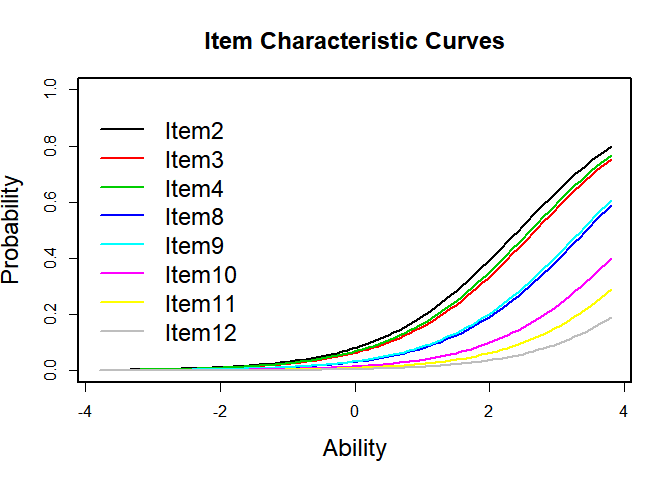

``` r
plot(fit.rasch, type = "IIC", annot = FALSE, cex.main = 1.5, cex.lab = 1.5)
```

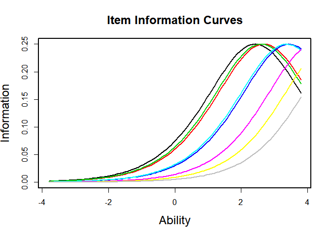

``` r
plot(fit.rasch, type = "IIC", items = 0, cex.main = 1.5, cex.lab = 1.5)
```

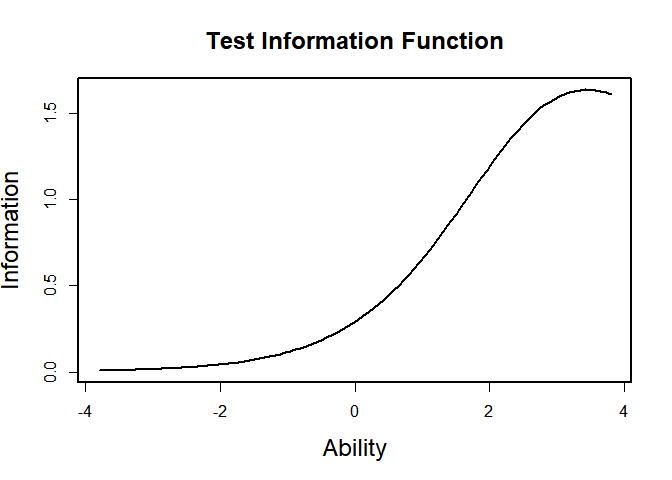

#### 2PL Model

``` r
#Fit a 2PL model - up to two latent variables with names z1 and z2
#I changed the number of quadrature points in order to get coefficients more similar to the mirt package??
fit.2pl<-ltm(items2~z1, IRT.param = T, control=list(GHk = 61, iter.qN = 50))

summary(fit.2pl)
```

    ## 
    ## Call:
    ## ltm(formula = items2 ~ z1, IRT.param = T, control = list(GHk = 61, 
    ##     iter.qN = 50))
    ## 
    ## Model Summary:
    ##    log.Lik      AIC      BIC
    ##  -50238.31 100508.6 100650.2
    ## 
    ## Coefficients:
    ##                value std.err   z.vals
    ## Dffclt.Item2  1.2626  0.0092 137.0053
    ## Dffclt.Item3  1.3830  0.0094 146.7817
    ## Dffclt.Item4  1.3858  0.0099 139.3759
    ## Dffclt.Item8  1.6916  0.0094 179.3936
    ## Dffclt.Item9  1.6566  0.0088 188.2249
    ## Dffclt.Item10 1.9862  0.0115 172.3578
    ## Dffclt.Item11 2.1950  0.0154 142.0881
    ## Dffclt.Item12 2.4060  0.0205 117.3275
    ## Dscrmn.Item2  6.3415  0.1324  47.8919
    ## Dscrmn.Item3  6.3599  0.1289  49.3526
    ## Dscrmn.Item4  4.5101  0.0806  55.9706
    ## Dscrmn.Item8  7.3436  0.2201  33.3592
    ## Dscrmn.Item9  8.3184  0.2872  28.9670
    ## Dscrmn.Item10 6.7368  0.2138  31.5161
    ## Dscrmn.Item11 5.4509  0.1910  28.5458
    ## Dscrmn.Item12 5.0711  0.2037  24.8990
    ## 
    ## Integration:
    ## method: Gauss-Hermite
    ## quadrature points: 61 
    ## 
    ## Optimization:
    ## Convergence: 0 
    ## max(|grad|): 0.027 
    ## quasi-Newton: BFGS

``` r
#Margins - is this due to sample size??
margins(fit.2pl)
```

    ## 
    ## Call:
    ## ltm(formula = items2 ~ z1, IRT.param = T, control = list(GHk = 61, 
    ##     iter.qN = 50))
    ## 
    ## Fit on the Two-Way Margins
    ## 
    ## Response: (0,0)
    ##   Item i Item j   Obs      Exp (O-E)^2/E    
    ## 1      2      4 45612 46448.58     15.07 ***
    ## 2      2      5 45638 46443.87     13.98 ***
    ## 3      1      5 44742 45489.85     12.29 ***
    ## 
    ## Response: (1,0)
    ##   Item i Item j  Obs     Exp (O-E)^2/E    
    ## 1      5      8 2623 2141.32    108.35 ***
    ## 2      5      7 2254 1837.70     94.30 ***
    ## 3      2      8 4725 4118.80     89.22 ***
    ## 
    ## Response: (0,1)
    ##   Item i Item j Obs    Exp (O-E)^2/E    
    ## 1      2      4 456 264.20    139.25 ***
    ## 2      1      2 579 922.54    127.93 ***
    ## 3      2      6 139  60.92    100.08 ***
    ## 
    ## Response: (1,1)
    ##   Item i Item j  Obs     Exp (O-E)^2/E    
    ## 1      1      2 4774 3785.68    258.02 ***
    ## 2      4      5 2452 1933.38    139.12 ***
    ## 3      2      3 3934 3324.08    111.91 ***
    ## 
    ## '***' denotes a chi-squared residual greater than 3.5

``` r
margins(fit.2pl, type="three-way")
```

    ## 
    ## Call:
    ## ltm(formula = items2 ~ z1, IRT.param = T, control = list(GHk = 61, 
    ##     iter.qN = 50))
    ## 
    ## Fit on the Three-Way Margins
    ## 
    ## Response: (0,0,0)
    ##   Item i Item j Item k   Obs      Exp (O-E)^2/E    
    ## 1      2      4      6 45562 46409.64     15.48 ***
    ## 2      2      4      8 45611 46434.79     14.61 ***
    ## 3      2      4      7 45601 46420.27     14.46 ***
    ## 
    ## Response: (1,0,0)
    ##   Item i Item j Item k  Obs     Exp (O-E)^2/E    
    ## 1      1      2      4 1343 1794.78    113.72 ***
    ## 2      1      2      5 1348 1780.39    105.01 ***
    ## 3      5      7      8 2065 1674.20     91.22 ***
    ## 
    ## Response: (0,1,0)
    ##   Item i Item j Item k Obs    Exp (O-E)^2/E    
    ## 1      1      2      5 452 826.37    169.60 ***
    ## 2      1      2      4 473 833.13    155.67 ***
    ## 3      1      2      7 544 909.93    147.16 ***
    ## 
    ## Response: (1,1,0)
    ##   Item i Item j Item k  Obs     Exp (O-E)^2/E    
    ## 1      1      2      4 2296 1561.92    345.01 ***
    ## 2      1      2      5 2120 1442.11    318.65 ***
    ## 3      1      2      6 3324 2446.12    315.06 ***
    ## 
    ## Response: (0,0,1)
    ##   Item i Item j Item k Obs   Exp (O-E)^2/E    
    ## 1      1      2      4 173 72.96    137.17 ***
    ## 2      1      2      5 152 63.28    124.40 ***
    ## 3      1      2      6  48 14.57     76.67 ***
    ## 
    ## Response: (1,0,1)
    ##   Item i Item j Item k Obs   Exp (O-E)^2/E    
    ## 1      4      5      8  48 14.77     74.79 ***
    ## 2      2      3      8  56 19.63     67.36 ***
    ## 3      1      3      8  56 21.76     53.90 ***
    ## 
    ## Response: (0,1,1)
    ##   Item i Item j Item k Obs   Exp (O-E)^2/E    
    ## 1      1      7      8  17  0.60    444.45 ***
    ## 2      1      4      5 175 41.93    422.38 ***
    ## 3      2      4      5 261 80.98    400.23 ***
    ## 
    ## Response: (1,1,1)
    ##   Item i Item j Item k  Obs     Exp (O-E)^2/E    
    ## 1      1      2      3 3677 2994.48    155.57 ***
    ## 2      3      4      5 2181 1788.47     86.15 ***
    ## 3      1      4      5 2277 1891.46     78.59 ***
    ## 
    ## '***' denotes a chi-squared residual greater than 3.5

``` r
#Compare the fit of the Rasch Model vs the 2PL Model - is this a better fit??
anova(fit.rasch, fit.2pl)
```

    ## 
    ##  Likelihood Ratio Table
    ##                AIC      BIC   log.Lik      LRT df p.value
    ## fit.rasch 141588.5 141659.2 -70786.22                    
    ## fit.2pl   100508.6 100650.2 -50238.31 41095.83  8  <0.001

``` r
#Residuals
#plot residuals vs ability to test homoscedasticity??
res.2pl<-residuals(fit.2pl)

#Factor scores - is the lack of a normal distribution here a problem??
fs.2pl<-factor.scores(fit.2pl)
#plot(fs.2pl)

#ICC and informaction curves
par(lwd=2)
plot(fit.2pl, legend = TRUE, cx = "left", cex.main = 1.5, cex.lab = 1.5, cex = 1.5)
```

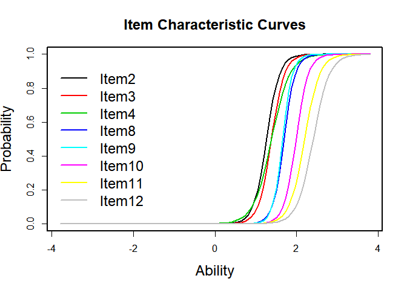

``` r
plot(fit.2pl, type = "IIC", annot = FALSE, cex.main = 1.5, cex.lab = 1.5)
```

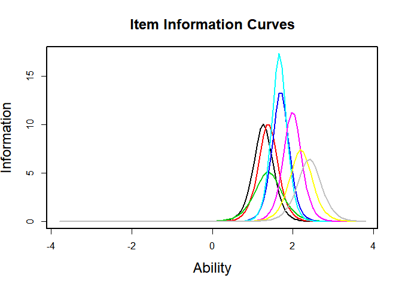

``` r
plot(fit.2pl, type = "IIC", items = 0, cex.main = 1.5, cex.lab = 1.5)
```

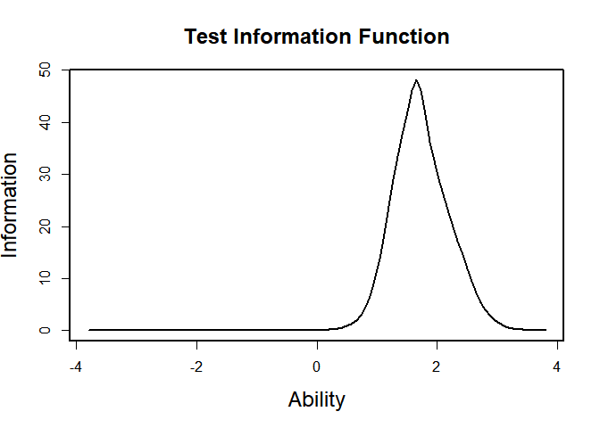

``` r
item.fit(fit.2pl, G = 4, FUN = mean)
```

    ## 
    ## Item-Fit Statistics and P-values
    ## 
    ## Call:
    ## ltm(formula = items2 ~ z1, IRT.param = T, control = list(GHk = 61, 
    ##     iter.qN = 50))
    ## 
    ## Alternative: Items do not fit the model
    ## Ability Categories: 4
    ## 
    ##                X^2 Pr(>X^2)
    ## Item2  281608.9248  <0.0001
    ## Item3  305832.9397  <0.0001
    ## Item4   38213.5321  <0.0001
    ## Item8   89985.9232  <0.0001
    ## Item9   94525.8073  <0.0001
    ## Item10   9120.6136  <0.0001
    ## Item11   1451.8249  <0.0001
    ## Item12     32.3548  <0.0001

#### Analysis with 'mirt' package

Since we need to include the survey weights in this analysis, it was decided to use the mirt package, which allows survey weights.

``` r
#Rasch model
fit.r <- mirt(items2, model=1, itemtype='Rasch')
```

    ## 
    Iteration: 1, Log-Lik: -71691.699, Max-Change: 0.69074
    Iteration: 2, Log-Lik: -68097.042, Max-Change: 0.45295
    Iteration: 3, Log-Lik: -65136.511, Max-Change: 0.53781
    Iteration: 4, Log-Lik: -63107.939, Max-Change: 1.06177
    Iteration: 5, Log-Lik: -59393.387, Max-Change: 0.74485
    Iteration: 6, Log-Lik: -58377.433, Max-Change: 0.55448
    Iteration: 7, Log-Lik: -57837.444, Max-Change: 0.40377
    Iteration: 8, Log-Lik: -57510.872, Max-Change: 0.28709
    Iteration: 9, Log-Lik: -57306.609, Max-Change: 0.20173
    Iteration: 10, Log-Lik: -57177.054, Max-Change: 0.14151
    Iteration: 11, Log-Lik: -57093.888, Max-Change: 0.09989
    Iteration: 12, Log-Lik: -57039.613, Max-Change: 0.07094
    Iteration: 13, Log-Lik: -57003.602, Max-Change: 0.05067
    Iteration: 14, Log-Lik: -56979.305, Max-Change: 0.03640
    Iteration: 15, Log-Lik: -56962.639, Max-Change: 0.02618
    Iteration: 16, Log-Lik: -56951.081, Max-Change: 0.01881
    Iteration: 17, Log-Lik: -56943.003, Max-Change: 0.01364
    Iteration: 18, Log-Lik: -56937.269, Max-Change: 0.00987
    Iteration: 19, Log-Lik: -56933.185, Max-Change: 0.00708
    Iteration: 20, Log-Lik: -56930.291, Max-Change: 0.00518
    Iteration: 21, Log-Lik: -56928.192, Max-Change: 0.00375
    Iteration: 22, Log-Lik: -56926.663, Max-Change: 0.00414
    Iteration: 23, Log-Lik: -56925.017, Max-Change: 0.00215
    Iteration: 24, Log-Lik: -56924.163, Max-Change: 0.00079
    Iteration: 25, Log-Lik: -56923.850, Max-Change: 0.00061
    Iteration: 26, Log-Lik: -56923.609, Max-Change: 0.00032
    Iteration: 27, Log-Lik: -56923.483, Max-Change: 0.00045
    Iteration: 28, Log-Lik: -56923.305, Max-Change: 0.00032
    Iteration: 29, Log-Lik: -56923.177, Max-Change: 0.00019
    Iteration: 30, Log-Lik: -56923.102, Max-Change: 0.00018
    Iteration: 31, Log-Lik: -56923.031, Max-Change: 0.00022
    Iteration: 32, Log-Lik: -56922.945, Max-Change: 0.00008

``` r
fit.rw <- mirt(items2, model=1, itemtype='Rasch', survey.weights = dat$weighth)
```

    ## 
    Iteration: 1, Log-Lik: -223177057.832, Max-Change: 0.63274
    Iteration: 2, Log-Lik: -211801641.681, Max-Change: 0.47370
    Iteration: 3, Log-Lik: -202384014.496, Max-Change: 0.56086
    Iteration: 4, Log-Lik: -195815915.894, Max-Change: 1.09756
    Iteration: 5, Log-Lik: -184340176.800, Max-Change: 0.76683
    Iteration: 6, Log-Lik: -181207949.621, Max-Change: 0.56382
    Iteration: 7, Log-Lik: -179563133.317, Max-Change: 0.40391
    Iteration: 8, Log-Lik: -178580473.402, Max-Change: 0.28229
    Iteration: 9, Log-Lik: -177972175.985, Max-Change: 0.19541
    Iteration: 10, Log-Lik: -177589622.197, Max-Change: 0.13554
    Iteration: 11, Log-Lik: -177345531.990, Max-Change: 0.09468
    Iteration: 12, Log-Lik: -177187179.699, Max-Change: 0.06672
    Iteration: 13, Log-Lik: -177082553.821, Max-Change: 0.04739
    Iteration: 14, Log-Lik: -177012167.385, Max-Change: 0.03388
    Iteration: 15, Log-Lik: -176964022.519, Max-Change: 0.02430
    Iteration: 16, Log-Lik: -176930666.795, Max-Change: 0.01739
    Iteration: 17, Log-Lik: -176907406.235, Max-Change: 0.01260
    Iteration: 18, Log-Lik: -176890898.444, Max-Change: 0.00910
    Iteration: 19, Log-Lik: -176879151.942, Max-Change: 0.00647
    Iteration: 20, Log-Lik: -176870895.567, Max-Change: 0.00475
    Iteration: 21, Log-Lik: -176864881.058, Max-Change: 0.00345
    Iteration: 22, Log-Lik: -176860540.128, Max-Change: 0.00250
    Iteration: 23, Log-Lik: -176857409.777, Max-Change: 0.00173
    Iteration: 24, Log-Lik: -176855248.369, Max-Change: 0.00070
    Iteration: 25, Log-Lik: -176854373.233, Max-Change: 0.00077
    Iteration: 26, Log-Lik: -176853417.981, Max-Change: 0.00073
    Iteration: 27, Log-Lik: -176852505.851, Max-Change: 0.00037
    Iteration: 28, Log-Lik: -176852045.521, Max-Change: 0.00053
    Iteration: 29, Log-Lik: -176851392.130, Max-Change: 0.00041
    Iteration: 30, Log-Lik: -176850882.778, Max-Change: 0.00026
    Iteration: 31, Log-Lik: -176850559.965, Max-Change: 0.00016
    Iteration: 32, Log-Lik: -176850374.723, Max-Change: 0.00017
    Iteration: 33, Log-Lik: -176850158.039, Max-Change: 0.00010
    Iteration: 34, Log-Lik: -176850028.142, Max-Change: 0.00011
    Iteration: 35, Log-Lik: -176849885.935, Max-Change: 0.00007

``` r
#2Pl model
fit.2 <- mirt(items2, model=1, itemtype='2PL')
```

    ## 
    Iteration: 1, Log-Lik: -74708.082, Max-Change: 2.93176
    Iteration: 2, Log-Lik: -57177.310, Max-Change: 4.48901
    Iteration: 3, Log-Lik: -52820.844, Max-Change: 2.38503
    Iteration: 4, Log-Lik: -51561.845, Max-Change: 1.45729
    Iteration: 5, Log-Lik: -51070.619, Max-Change: 0.99734
    Iteration: 6, Log-Lik: -50815.157, Max-Change: 0.78994
    Iteration: 7, Log-Lik: -50660.210, Max-Change: 0.57658
    Iteration: 8, Log-Lik: -50558.726, Max-Change: 0.41991
    Iteration: 9, Log-Lik: -50487.560, Max-Change: 0.33590
    Iteration: 10, Log-Lik: -50434.053, Max-Change: 0.20188
    Iteration: 11, Log-Lik: -50392.732, Max-Change: 0.16152
    Iteration: 12, Log-Lik: -50359.370, Max-Change: 0.11507
    Iteration: 13, Log-Lik: -50331.950, Max-Change: 0.09963
    Iteration: 14, Log-Lik: -50308.880, Max-Change: 0.11718
    Iteration: 15, Log-Lik: -50289.157, Max-Change: 0.05190
    Iteration: 16, Log-Lik: -50272.624, Max-Change: 0.07502
    Iteration: 17, Log-Lik: -50258.107, Max-Change: 0.04148
    Iteration: 18, Log-Lik: -50245.652, Max-Change: 0.03958
    Iteration: 19, Log-Lik: -50234.811, Max-Change: 0.05391
    Iteration: 20, Log-Lik: -50225.305, Max-Change: 0.03363
    Iteration: 21, Log-Lik: -50217.052, Max-Change: 0.03974
    Iteration: 22, Log-Lik: -50209.782, Max-Change: 0.02287
    Iteration: 23, Log-Lik: -50203.474, Max-Change: 0.02648
    Iteration: 24, Log-Lik: -50197.931, Max-Change: 0.03305
    Iteration: 25, Log-Lik: -50193.033, Max-Change: 0.01895
    Iteration: 26, Log-Lik: -50188.766, Max-Change: 0.02440
    Iteration: 27, Log-Lik: -50185.003, Max-Change: 0.01703
    Iteration: 28, Log-Lik: -50179.885, Max-Change: 0.02191
    Iteration: 29, Log-Lik: -50177.179, Max-Change: 0.01526
    Iteration: 30, Log-Lik: -50174.789, Max-Change: 0.01476
    Iteration: 31, Log-Lik: -50164.121, Max-Change: 0.00730
    Iteration: 32, Log-Lik: -50163.265, Max-Change: 0.01612
    Iteration: 33, Log-Lik: -50162.475, Max-Change: 0.00650
    Iteration: 34, Log-Lik: -50162.150, Max-Change: 0.00633
    Iteration: 35, Log-Lik: -50161.514, Max-Change: 0.01024
    Iteration: 36, Log-Lik: -50160.936, Max-Change: 0.00562
    Iteration: 37, Log-Lik: -50160.560, Max-Change: 0.00552
    Iteration: 38, Log-Lik: -50160.089, Max-Change: 0.00980
    Iteration: 39, Log-Lik: -50159.660, Max-Change: 0.00504
    Iteration: 40, Log-Lik: -50159.437, Max-Change: 0.00460
    Iteration: 41, Log-Lik: -50159.091, Max-Change: 0.01631
    Iteration: 42, Log-Lik: -50158.788, Max-Change: 0.00446
    Iteration: 43, Log-Lik: -50158.713, Max-Change: 0.00435
    Iteration: 44, Log-Lik: -50158.443, Max-Change: 0.00400
    Iteration: 45, Log-Lik: -50158.206, Max-Change: 0.00380
    Iteration: 46, Log-Lik: -50157.137, Max-Change: 0.00255
    Iteration: 47, Log-Lik: -50157.049, Max-Change: 0.00228
    Iteration: 48, Log-Lik: -50156.970, Max-Change: 0.00215
    Iteration: 49, Log-Lik: -50156.614, Max-Change: 0.00978
    Iteration: 50, Log-Lik: -50156.570, Max-Change: 0.00152
    Iteration: 51, Log-Lik: -50156.540, Max-Change: 0.00129
    Iteration: 52, Log-Lik: -50156.474, Max-Change: 0.00153
    Iteration: 53, Log-Lik: -50156.456, Max-Change: 0.00103
    Iteration: 54, Log-Lik: -50156.440, Max-Change: 0.01134
    Iteration: 55, Log-Lik: -50156.412, Max-Change: 0.00103
    Iteration: 56, Log-Lik: -50156.399, Max-Change: 0.00113
    Iteration: 57, Log-Lik: -50156.388, Max-Change: 0.00079
    Iteration: 58, Log-Lik: -50156.374, Max-Change: 0.00083
    Iteration: 59, Log-Lik: -50156.365, Max-Change: 0.00073
    Iteration: 60, Log-Lik: -50156.357, Max-Change: 0.00069
    Iteration: 61, Log-Lik: -50156.323, Max-Change: 0.00048
    Iteration: 62, Log-Lik: -50156.321, Max-Change: 0.00046
    Iteration: 63, Log-Lik: -50156.318, Max-Change: 0.00044
    Iteration: 64, Log-Lik: -50156.306, Max-Change: 0.00037
    Iteration: 65, Log-Lik: -50156.305, Max-Change: 0.00033
    Iteration: 66, Log-Lik: -50156.304, Max-Change: 0.00032
    Iteration: 67, Log-Lik: -50156.299, Max-Change: 0.00024
    Iteration: 68, Log-Lik: -50156.299, Max-Change: 0.00014
    Iteration: 69, Log-Lik: -50156.298, Max-Change: 0.00013
    Iteration: 70, Log-Lik: -50156.298, Max-Change: 0.00013
    Iteration: 71, Log-Lik: -50156.297, Max-Change: 0.00011
    Iteration: 72, Log-Lik: -50156.297, Max-Change: 0.00011
    Iteration: 73, Log-Lik: -50156.296, Max-Change: 0.00012
    Iteration: 74, Log-Lik: -50156.296, Max-Change: 0.00009

``` r
fit.2w <- mirt(items2, model=1, itemtype='2PL', survey.weights = dat$weighth)
```

    ## 
    Iteration: 1, Log-Lik: -232882206.708, Max-Change: 2.85438
    Iteration: 2, Log-Lik: -177518181.027, Max-Change: 2.06446
    Iteration: 3, Log-Lik: -163262118.808, Max-Change: 2.71548
    Iteration: 4, Log-Lik: -159127884.256, Max-Change: 0.59816
    Iteration: 5, Log-Lik: -157700070.772, Max-Change: 0.93832
    Iteration: 6, Log-Lik: -157135576.288, Max-Change: 0.65905
    Iteration: 7, Log-Lik: -156773380.104, Max-Change: 0.61091
    Iteration: 8, Log-Lik: -156491515.774, Max-Change: 0.25478
    Iteration: 9, Log-Lik: -156314200.306, Max-Change: 0.15361
    Iteration: 10, Log-Lik: -156187826.275, Max-Change: 0.21287
    Iteration: 11, Log-Lik: -156083725.573, Max-Change: 0.18213
    Iteration: 12, Log-Lik: -155992579.911, Max-Change: 0.10763
    Iteration: 13, Log-Lik: -155921070.535, Max-Change: 0.08913
    Iteration: 14, Log-Lik: -155861310.925, Max-Change: 0.07457
    Iteration: 15, Log-Lik: -155811250.020, Max-Change: 0.06319
    Iteration: 16, Log-Lik: -155768180.570, Max-Change: 0.05495
    Iteration: 17, Log-Lik: -155730845.920, Max-Change: 0.04844
    Iteration: 18, Log-Lik: -155698337.960, Max-Change: 0.04012
    Iteration: 19, Log-Lik: -155669665.460, Max-Change: 0.04262
    Iteration: 20, Log-Lik: -155644442.420, Max-Change: 0.04142
    Iteration: 21, Log-Lik: -155622390.330, Max-Change: 0.03043
    Iteration: 22, Log-Lik: -155603123.857, Max-Change: 0.02671
    Iteration: 23, Log-Lik: -155586224.500, Max-Change: 0.02411
    Iteration: 24, Log-Lik: -155571355.753, Max-Change: 0.02573
    Iteration: 25, Log-Lik: -155558262.417, Max-Change: 0.02136
    Iteration: 26, Log-Lik: -155546766.941, Max-Change: 0.02000
    Iteration: 27, Log-Lik: -155536583.995, Max-Change: 0.02208
    Iteration: 28, Log-Lik: -155527548.985, Max-Change: 0.01475
    Iteration: 29, Log-Lik: -155519593.640, Max-Change: 0.01441
    Iteration: 30, Log-Lik: -155512528.460, Max-Change: 0.01395
    Iteration: 31, Log-Lik: -155506268.205, Max-Change: 0.01341
    Iteration: 32, Log-Lik: -155500723.354, Max-Change: 0.01283
    Iteration: 33, Log-Lik: -155495812.138, Max-Change: 0.01225
    Iteration: 34, Log-Lik: -155491459.657, Max-Change: 0.01160
    Iteration: 35, Log-Lik: -155487563.799, Max-Change: 0.01106
    Iteration: 36, Log-Lik: -155484103.666, Max-Change: 0.01057
    Iteration: 37, Log-Lik: -155481030.486, Max-Change: 0.00749
    Iteration: 38, Log-Lik: -155478360.470, Max-Change: 0.01325
    Iteration: 39, Log-Lik: -155475925.007, Max-Change: 0.00630
    Iteration: 40, Log-Lik: -155473784.009, Max-Change: 0.00793
    Iteration: 41, Log-Lik: -155471889.287, Max-Change: 0.01145
    Iteration: 42, Log-Lik: -155470162.676, Max-Change: 0.00537
    Iteration: 43, Log-Lik: -155468653.903, Max-Change: 0.00640
    Iteration: 44, Log-Lik: -155467300.271, Max-Change: 0.01070
    Iteration: 45, Log-Lik: -155466085.646, Max-Change: 0.00442
    Iteration: 46, Log-Lik: -155465022.067, Max-Change: 0.00546
    Iteration: 47, Log-Lik: -155464065.321, Max-Change: 0.00418
    Iteration: 48, Log-Lik: -155463223.674, Max-Change: 0.00530
    Iteration: 49, Log-Lik: -155462462.723, Max-Change: 0.00381
    Iteration: 50, Log-Lik: -155461795.407, Max-Change: 0.00353
    Iteration: 51, Log-Lik: -155461211.394, Max-Change: 0.00588
    Iteration: 52, Log-Lik: -155460667.048, Max-Change: 0.00321
    Iteration: 53, Log-Lik: -155460204.390, Max-Change: 0.00281
    Iteration: 54, Log-Lik: -155459786.447, Max-Change: 0.00268
    Iteration: 55, Log-Lik: -155459413.815, Max-Change: 0.00254
    Iteration: 56, Log-Lik: -155459082.133, Max-Change: 0.00241
    Iteration: 57, Log-Lik: -155458786.951, Max-Change: 0.00229
    Iteration: 58, Log-Lik: -155458524.173, Max-Change: 0.00217
    Iteration: 59, Log-Lik: -155458290.154, Max-Change: 0.00205
    Iteration: 60, Log-Lik: -155458081.661, Max-Change: 0.00216
    Iteration: 61, Log-Lik: -155457897.257, Max-Change: 0.00206
    Iteration: 62, Log-Lik: -155457727.123, Max-Change: 0.00541
    Iteration: 63, Log-Lik: -155457554.438, Max-Change: 0.00198
    Iteration: 64, Log-Lik: -155457423.143, Max-Change: 0.00178
    Iteration: 65, Log-Lik: -155457301.808, Max-Change: 0.00171
    Iteration: 66, Log-Lik: -155457191.391, Max-Change: 0.01138
    Iteration: 67, Log-Lik: -155457051.929, Max-Change: 0.00171
    Iteration: 68, Log-Lik: -155456966.051, Max-Change: 0.00126
    Iteration: 69, Log-Lik: -155456888.477, Max-Change: 0.00141
    Iteration: 70, Log-Lik: -155456819.916, Max-Change: 0.00106
    Iteration: 71, Log-Lik: -155456759.711, Max-Change: 0.00130
    Iteration: 72, Log-Lik: -155456703.020, Max-Change: 0.00095
    Iteration: 73, Log-Lik: -155456655.143, Max-Change: 0.00119
    Iteration: 74, Log-Lik: -155456609.895, Max-Change: 0.00086
    Iteration: 75, Log-Lik: -155456571.948, Max-Change: 0.00085
    Iteration: 76, Log-Lik: -155456537.117, Max-Change: 0.00080
    Iteration: 77, Log-Lik: -155456506.493, Max-Change: 0.00075
    Iteration: 78, Log-Lik: -155456479.266, Max-Change: 0.00072
    Iteration: 79, Log-Lik: -155456454.989, Max-Change: 0.00068
    Iteration: 80, Log-Lik: -155456433.237, Max-Change: 0.00064
    Iteration: 81, Log-Lik: -155456413.835, Max-Change: 0.00063
    Iteration: 82, Log-Lik: -155456396.489, Max-Change: 0.00060
    Iteration: 83, Log-Lik: -155456380.635, Max-Change: 0.00057
    Iteration: 84, Log-Lik: -155456366.502, Max-Change: 0.00054
    Iteration: 85, Log-Lik: -155456353.866, Max-Change: 0.00051
    Iteration: 86, Log-Lik: -155456342.562, Max-Change: 0.00049
    Iteration: 87, Log-Lik: -155456332.439, Max-Change: 0.00046
    Iteration: 88, Log-Lik: -155456323.363, Max-Change: 0.00044
    Iteration: 89, Log-Lik: -155456315.215, Max-Change: 0.00042
    Iteration: 90, Log-Lik: -155456307.891, Max-Change: 0.00046
    Iteration: 91, Log-Lik: -155456301.322, Max-Change: 0.00042
    Iteration: 92, Log-Lik: -155456294.924, Max-Change: 0.00041
    Iteration: 93, Log-Lik: -155456289.068, Max-Change: 0.00039
    Iteration: 94, Log-Lik: -155456283.773, Max-Change: 0.00037
    Iteration: 95, Log-Lik: -155456278.977, Max-Change: 0.00036
    Iteration: 96, Log-Lik: -155456274.626, Max-Change: 0.00035
    Iteration: 97, Log-Lik: -155456253.696, Max-Change: 0.00025
    Iteration: 98, Log-Lik: -155456252.254, Max-Change: 0.00016
    Iteration: 99, Log-Lik: -155456251.050, Max-Change: 0.00014
    Iteration: 100, Log-Lik: -155456247.638, Max-Change: 0.00013
    Iteration: 101, Log-Lik: -155456246.758, Max-Change: 0.00012
    Iteration: 102, Log-Lik: -155456245.956, Max-Change: 0.00012
    Iteration: 103, Log-Lik: -155456241.937, Max-Change: 0.00012
    Iteration: 104, Log-Lik: -155456241.387, Max-Change: 0.00050
    Iteration: 105, Log-Lik: -155456239.096, Max-Change: 0.00018
    Iteration: 106, Log-Lik: -155456238.908, Max-Change: 0.00013
    Iteration: 107, Log-Lik: -155456238.460, Max-Change: 0.00044
    Iteration: 108, Log-Lik: -155456236.750, Max-Change: 0.00022
    Iteration: 109, Log-Lik: -155456236.489, Max-Change: 0.00014
    Iteration: 110, Log-Lik: -155456236.090, Max-Change: 0.00041
    Iteration: 111, Log-Lik: -155456234.727, Max-Change: 0.00024
    Iteration: 112, Log-Lik: -155456234.396, Max-Change: 0.00014
    Iteration: 113, Log-Lik: -155456234.027, Max-Change: 0.00037
    Iteration: 114, Log-Lik: -155456232.860, Max-Change: 0.00025
    Iteration: 115, Log-Lik: -155456232.495, Max-Change: 0.00013
    Iteration: 116, Log-Lik: -155456232.147, Max-Change: 0.00036
    Iteration: 117, Log-Lik: -155456231.090, Max-Change: 0.00025
    Iteration: 118, Log-Lik: -155456230.720, Max-Change: 0.00013
    Iteration: 119, Log-Lik: -155456230.391, Max-Change: 0.00035
    Iteration: 120, Log-Lik: -155456229.399, Max-Change: 0.00025
    Iteration: 121, Log-Lik: -155456229.039, Max-Change: 0.00012
    Iteration: 122, Log-Lik: -155456228.725, Max-Change: 0.00034
    Iteration: 123, Log-Lik: -155456227.778, Max-Change: 0.00024
    Iteration: 124, Log-Lik: -155456227.433, Max-Change: 0.00012
    Iteration: 125, Log-Lik: -155456227.132, Max-Change: 0.00034
    Iteration: 126, Log-Lik: -155456226.222, Max-Change: 0.00023
    Iteration: 127, Log-Lik: -155456225.892, Max-Change: 0.00012
    Iteration: 128, Log-Lik: -155456225.603, Max-Change: 0.00033
    Iteration: 129, Log-Lik: -155456224.724, Max-Change: 0.00023
    Iteration: 130, Log-Lik: -155456224.409, Max-Change: 0.00011
    Iteration: 131, Log-Lik: -155456224.131, Max-Change: 0.00033
    Iteration: 132, Log-Lik: -155456223.281, Max-Change: 0.00022
    Iteration: 133, Log-Lik: -155456222.980, Max-Change: 0.00011
    Iteration: 134, Log-Lik: -155456222.711, Max-Change: 0.00032
    Iteration: 135, Log-Lik: -155456221.890, Max-Change: 0.00021
    Iteration: 136, Log-Lik: -155456221.600, Max-Change: 0.00011
    Iteration: 137, Log-Lik: -155456221.341, Max-Change: 0.00032
    Iteration: 138, Log-Lik: -155456220.546, Max-Change: 0.00021
    Iteration: 139, Log-Lik: -155456220.267, Max-Change: 0.00010
    Iteration: 140, Log-Lik: -155456220.017, Max-Change: 0.00032
    Iteration: 141, Log-Lik: -155456219.248, Max-Change: 0.00020
    Iteration: 142, Log-Lik: -155456218.979, Max-Change: 0.00010
    Iteration: 143, Log-Lik: -155456218.737, Max-Change: 0.00031
    Iteration: 144, Log-Lik: -155456217.992, Max-Change: 0.00020
    Iteration: 145, Log-Lik: -155456217.733, Max-Change: 0.00010

``` r
#Extract the discrimination parameters
function(model) {
a <- coef(model, as.data.frame=T)
a[seq(1,length(a),4)]
}
```

    ## function(model) {
    ## a <- coef(model, as.data.frame=T)
    ## a[seq(1,length(a),4)]
    ## }

``` r
#Extract the difficulty parameters
```

``` r
#Comparing discrimination parameter using ltm vs mirt (no weighting)
#First we fit the 2PL model using the mirt package
fit.2pl.mirt <- mirt(items2, model=1, itemtype='2PL')
```

    ## 
    Iteration: 1, Log-Lik: -74708.082, Max-Change: 2.93176
    Iteration: 2, Log-Lik: -57177.310, Max-Change: 4.48901
    Iteration: 3, Log-Lik: -52820.844, Max-Change: 2.38503
    Iteration: 4, Log-Lik: -51561.845, Max-Change: 1.45729
    Iteration: 5, Log-Lik: -51070.619, Max-Change: 0.99734
    Iteration: 6, Log-Lik: -50815.157, Max-Change: 0.78994
    Iteration: 7, Log-Lik: -50660.210, Max-Change: 0.57658
    Iteration: 8, Log-Lik: -50558.726, Max-Change: 0.41991
    Iteration: 9, Log-Lik: -50487.560, Max-Change: 0.33590
    Iteration: 10, Log-Lik: -50434.053, Max-Change: 0.20188
    Iteration: 11, Log-Lik: -50392.732, Max-Change: 0.16152
    Iteration: 12, Log-Lik: -50359.370, Max-Change: 0.11507
    Iteration: 13, Log-Lik: -50331.950, Max-Change: 0.09963
    Iteration: 14, Log-Lik: -50308.880, Max-Change: 0.11718
    Iteration: 15, Log-Lik: -50289.157, Max-Change: 0.05190
    Iteration: 16, Log-Lik: -50272.624, Max-Change: 0.07502
    Iteration: 17, Log-Lik: -50258.107, Max-Change: 0.04148
    Iteration: 18, Log-Lik: -50245.652, Max-Change: 0.03958
    Iteration: 19, Log-Lik: -50234.811, Max-Change: 0.05391
    Iteration: 20, Log-Lik: -50225.305, Max-Change: 0.03363
    Iteration: 21, Log-Lik: -50217.052, Max-Change: 0.03974
    Iteration: 22, Log-Lik: -50209.782, Max-Change: 0.02287
    Iteration: 23, Log-Lik: -50203.474, Max-Change: 0.02648
    Iteration: 24, Log-Lik: -50197.931, Max-Change: 0.03305
    Iteration: 25, Log-Lik: -50193.033, Max-Change: 0.01895
    Iteration: 26, Log-Lik: -50188.766, Max-Change: 0.02440
    Iteration: 27, Log-Lik: -50185.003, Max-Change: 0.01703
    Iteration: 28, Log-Lik: -50179.885, Max-Change: 0.02191
    Iteration: 29, Log-Lik: -50177.179, Max-Change: 0.01526
    Iteration: 30, Log-Lik: -50174.789, Max-Change: 0.01476
    Iteration: 31, Log-Lik: -50164.121, Max-Change: 0.00730
    Iteration: 32, Log-Lik: -50163.265, Max-Change: 0.01612
    Iteration: 33, Log-Lik: -50162.475, Max-Change: 0.00650
    Iteration: 34, Log-Lik: -50162.150, Max-Change: 0.00633
    Iteration: 35, Log-Lik: -50161.514, Max-Change: 0.01024
    Iteration: 36, Log-Lik: -50160.936, Max-Change: 0.00562
    Iteration: 37, Log-Lik: -50160.560, Max-Change: 0.00552
    Iteration: 38, Log-Lik: -50160.089, Max-Change: 0.00980
    Iteration: 39, Log-Lik: -50159.660, Max-Change: 0.00504
    Iteration: 40, Log-Lik: -50159.437, Max-Change: 0.00460
    Iteration: 41, Log-Lik: -50159.091, Max-Change: 0.01631
    Iteration: 42, Log-Lik: -50158.788, Max-Change: 0.00446
    Iteration: 43, Log-Lik: -50158.713, Max-Change: 0.00435
    Iteration: 44, Log-Lik: -50158.443, Max-Change: 0.00400
    Iteration: 45, Log-Lik: -50158.206, Max-Change: 0.00380
    Iteration: 46, Log-Lik: -50157.137, Max-Change: 0.00255
    Iteration: 47, Log-Lik: -50157.049, Max-Change: 0.00228
    Iteration: 48, Log-Lik: -50156.970, Max-Change: 0.00215
    Iteration: 49, Log-Lik: -50156.614, Max-Change: 0.00978
    Iteration: 50, Log-Lik: -50156.570, Max-Change: 0.00152
    Iteration: 51, Log-Lik: -50156.540, Max-Change: 0.00129
    Iteration: 52, Log-Lik: -50156.474, Max-Change: 0.00153
    Iteration: 53, Log-Lik: -50156.456, Max-Change: 0.00103
    Iteration: 54, Log-Lik: -50156.440, Max-Change: 0.01134
    Iteration: 55, Log-Lik: -50156.412, Max-Change: 0.00103
    Iteration: 56, Log-Lik: -50156.399, Max-Change: 0.00113
    Iteration: 57, Log-Lik: -50156.388, Max-Change: 0.00079
    Iteration: 58, Log-Lik: -50156.374, Max-Change: 0.00083
    Iteration: 59, Log-Lik: -50156.365, Max-Change: 0.00073
    Iteration: 60, Log-Lik: -50156.357, Max-Change: 0.00069
    Iteration: 61, Log-Lik: -50156.323, Max-Change: 0.00048
    Iteration: 62, Log-Lik: -50156.321, Max-Change: 0.00046
    Iteration: 63, Log-Lik: -50156.318, Max-Change: 0.00044
    Iteration: 64, Log-Lik: -50156.306, Max-Change: 0.00037
    Iteration: 65, Log-Lik: -50156.305, Max-Change: 0.00033
    Iteration: 66, Log-Lik: -50156.304, Max-Change: 0.00032
    Iteration: 67, Log-Lik: -50156.299, Max-Change: 0.00024
    Iteration: 68, Log-Lik: -50156.299, Max-Change: 0.00014
    Iteration: 69, Log-Lik: -50156.298, Max-Change: 0.00013
    Iteration: 70, Log-Lik: -50156.298, Max-Change: 0.00013
    Iteration: 71, Log-Lik: -50156.297, Max-Change: 0.00011
    Iteration: 72, Log-Lik: -50156.297, Max-Change: 0.00011
    Iteration: 73, Log-Lik: -50156.296, Max-Change: 0.00012
    Iteration: 74, Log-Lik: -50156.296, Max-Change: 0.00009

``` r
coef(fit.2pl.mirt, simplify=T)
```

    ## $items
    ##           a1       d g u
    ## Item2  6.887  -8.376 0 1
    ## Item3  6.878  -9.141 0 1
    ## Item4  4.729  -6.307 0 1
    ## Item8  7.780 -12.621 0 1
    ## Item9  8.715 -13.849 0 1
    ## Item10 7.052 -13.430 0 1
    ## Item11 5.560 -11.765 0 1
    ## Item12 5.163 -12.004 0 1
    ## 
    ## $means
    ## F1 
    ##  0 
    ## 
    ## $cov
    ##    F1
    ## F1  1

``` r
#Using mirt and survey weights
fit.2pl.mirtw <- mirt(items2, 1, itemtype='2PL', survey.weights = dat$weighth)
```

    ## 
    Iteration: 1, Log-Lik: -232882206.708, Max-Change: 2.85438
    Iteration: 2, Log-Lik: -177518181.027, Max-Change: 2.06446
    Iteration: 3, Log-Lik: -163262118.808, Max-Change: 2.71548
    Iteration: 4, Log-Lik: -159127884.256, Max-Change: 0.59816
    Iteration: 5, Log-Lik: -157700070.772, Max-Change: 0.93832
    Iteration: 6, Log-Lik: -157135576.288, Max-Change: 0.65905
    Iteration: 7, Log-Lik: -156773380.104, Max-Change: 0.61091
    Iteration: 8, Log-Lik: -156491515.774, Max-Change: 0.25478
    Iteration: 9, Log-Lik: -156314200.306, Max-Change: 0.15361
    Iteration: 10, Log-Lik: -156187826.275, Max-Change: 0.21287
    Iteration: 11, Log-Lik: -156083725.573, Max-Change: 0.18213
    Iteration: 12, Log-Lik: -155992579.911, Max-Change: 0.10763
    Iteration: 13, Log-Lik: -155921070.535, Max-Change: 0.08913
    Iteration: 14, Log-Lik: -155861310.925, Max-Change: 0.07457
    Iteration: 15, Log-Lik: -155811250.020, Max-Change: 0.06319
    Iteration: 16, Log-Lik: -155768180.570, Max-Change: 0.05495
    Iteration: 17, Log-Lik: -155730845.920, Max-Change: 0.04844
    Iteration: 18, Log-Lik: -155698337.960, Max-Change: 0.04012
    Iteration: 19, Log-Lik: -155669665.460, Max-Change: 0.04262
    Iteration: 20, Log-Lik: -155644442.420, Max-Change: 0.04142
    Iteration: 21, Log-Lik: -155622390.330, Max-Change: 0.03043
    Iteration: 22, Log-Lik: -155603123.857, Max-Change: 0.02671
    Iteration: 23, Log-Lik: -155586224.500, Max-Change: 0.02411
    Iteration: 24, Log-Lik: -155571355.753, Max-Change: 0.02573
    Iteration: 25, Log-Lik: -155558262.417, Max-Change: 0.02136
    Iteration: 26, Log-Lik: -155546766.941, Max-Change: 0.02000
    Iteration: 27, Log-Lik: -155536583.995, Max-Change: 0.02208
    Iteration: 28, Log-Lik: -155527548.985, Max-Change: 0.01475
    Iteration: 29, Log-Lik: -155519593.640, Max-Change: 0.01441
    Iteration: 30, Log-Lik: -155512528.460, Max-Change: 0.01395
    Iteration: 31, Log-Lik: -155506268.205, Max-Change: 0.01341
    Iteration: 32, Log-Lik: -155500723.354, Max-Change: 0.01283
    Iteration: 33, Log-Lik: -155495812.138, Max-Change: 0.01225
    Iteration: 34, Log-Lik: -155491459.657, Max-Change: 0.01160
    Iteration: 35, Log-Lik: -155487563.799, Max-Change: 0.01106
    Iteration: 36, Log-Lik: -155484103.666, Max-Change: 0.01057
    Iteration: 37, Log-Lik: -155481030.486, Max-Change: 0.00749
    Iteration: 38, Log-Lik: -155478360.470, Max-Change: 0.01325
    Iteration: 39, Log-Lik: -155475925.007, Max-Change: 0.00630
    Iteration: 40, Log-Lik: -155473784.009, Max-Change: 0.00793
    Iteration: 41, Log-Lik: -155471889.287, Max-Change: 0.01145
    Iteration: 42, Log-Lik: -155470162.676, Max-Change: 0.00537
    Iteration: 43, Log-Lik: -155468653.903, Max-Change: 0.00640
    Iteration: 44, Log-Lik: -155467300.271, Max-Change: 0.01070
    Iteration: 45, Log-Lik: -155466085.646, Max-Change: 0.00442
    Iteration: 46, Log-Lik: -155465022.067, Max-Change: 0.00546
    Iteration: 47, Log-Lik: -155464065.321, Max-Change: 0.00418
    Iteration: 48, Log-Lik: -155463223.674, Max-Change: 0.00530
    Iteration: 49, Log-Lik: -155462462.723, Max-Change: 0.00381
    Iteration: 50, Log-Lik: -155461795.407, Max-Change: 0.00353
    Iteration: 51, Log-Lik: -155461211.394, Max-Change: 0.00588
    Iteration: 52, Log-Lik: -155460667.048, Max-Change: 0.00321
    Iteration: 53, Log-Lik: -155460204.390, Max-Change: 0.00281
    Iteration: 54, Log-Lik: -155459786.447, Max-Change: 0.00268
    Iteration: 55, Log-Lik: -155459413.815, Max-Change: 0.00254
    Iteration: 56, Log-Lik: -155459082.133, Max-Change: 0.00241
    Iteration: 57, Log-Lik: -155458786.951, Max-Change: 0.00229
    Iteration: 58, Log-Lik: -155458524.173, Max-Change: 0.00217
    Iteration: 59, Log-Lik: -155458290.154, Max-Change: 0.00205
    Iteration: 60, Log-Lik: -155458081.661, Max-Change: 0.00216
    Iteration: 61, Log-Lik: -155457897.257, Max-Change: 0.00206
    Iteration: 62, Log-Lik: -155457727.123, Max-Change: 0.00541
    Iteration: 63, Log-Lik: -155457554.438, Max-Change: 0.00198
    Iteration: 64, Log-Lik: -155457423.143, Max-Change: 0.00178
    Iteration: 65, Log-Lik: -155457301.808, Max-Change: 0.00171
    Iteration: 66, Log-Lik: -155457191.391, Max-Change: 0.01138
    Iteration: 67, Log-Lik: -155457051.929, Max-Change: 0.00171
    Iteration: 68, Log-Lik: -155456966.051, Max-Change: 0.00126
    Iteration: 69, Log-Lik: -155456888.477, Max-Change: 0.00141
    Iteration: 70, Log-Lik: -155456819.916, Max-Change: 0.00106
    Iteration: 71, Log-Lik: -155456759.711, Max-Change: 0.00130
    Iteration: 72, Log-Lik: -155456703.020, Max-Change: 0.00095
    Iteration: 73, Log-Lik: -155456655.143, Max-Change: 0.00119
    Iteration: 74, Log-Lik: -155456609.895, Max-Change: 0.00086
    Iteration: 75, Log-Lik: -155456571.948, Max-Change: 0.00085
    Iteration: 76, Log-Lik: -155456537.117, Max-Change: 0.00080
    Iteration: 77, Log-Lik: -155456506.493, Max-Change: 0.00075
    Iteration: 78, Log-Lik: -155456479.266, Max-Change: 0.00072
    Iteration: 79, Log-Lik: -155456454.989, Max-Change: 0.00068
    Iteration: 80, Log-Lik: -155456433.237, Max-Change: 0.00064
    Iteration: 81, Log-Lik: -155456413.835, Max-Change: 0.00063
    Iteration: 82, Log-Lik: -155456396.489, Max-Change: 0.00060
    Iteration: 83, Log-Lik: -155456380.635, Max-Change: 0.00057
    Iteration: 84, Log-Lik: -155456366.502, Max-Change: 0.00054
    Iteration: 85, Log-Lik: -155456353.866, Max-Change: 0.00051
    Iteration: 86, Log-Lik: -155456342.562, Max-Change: 0.00049
    Iteration: 87, Log-Lik: -155456332.439, Max-Change: 0.00046
    Iteration: 88, Log-Lik: -155456323.363, Max-Change: 0.00044
    Iteration: 89, Log-Lik: -155456315.215, Max-Change: 0.00042
    Iteration: 90, Log-Lik: -155456307.891, Max-Change: 0.00046
    Iteration: 91, Log-Lik: -155456301.322, Max-Change: 0.00042
    Iteration: 92, Log-Lik: -155456294.924, Max-Change: 0.00041
    Iteration: 93, Log-Lik: -155456289.068, Max-Change: 0.00039
    Iteration: 94, Log-Lik: -155456283.773, Max-Change: 0.00037
    Iteration: 95, Log-Lik: -155456278.977, Max-Change: 0.00036
    Iteration: 96, Log-Lik: -155456274.626, Max-Change: 0.00035
    Iteration: 97, Log-Lik: -155456253.696, Max-Change: 0.00025
    Iteration: 98, Log-Lik: -155456252.254, Max-Change: 0.00016
    Iteration: 99, Log-Lik: -155456251.050, Max-Change: 0.00014
    Iteration: 100, Log-Lik: -155456247.638, Max-Change: 0.00013
    Iteration: 101, Log-Lik: -155456246.758, Max-Change: 0.00012
    Iteration: 102, Log-Lik: -155456245.956, Max-Change: 0.00012
    Iteration: 103, Log-Lik: -155456241.937, Max-Change: 0.00012
    Iteration: 104, Log-Lik: -155456241.387, Max-Change: 0.00050
    Iteration: 105, Log-Lik: -155456239.096, Max-Change: 0.00018
    Iteration: 106, Log-Lik: -155456238.908, Max-Change: 0.00013
    Iteration: 107, Log-Lik: -155456238.460, Max-Change: 0.00044
    Iteration: 108, Log-Lik: -155456236.750, Max-Change: 0.00022
    Iteration: 109, Log-Lik: -155456236.489, Max-Change: 0.00014
    Iteration: 110, Log-Lik: -155456236.090, Max-Change: 0.00041
    Iteration: 111, Log-Lik: -155456234.727, Max-Change: 0.00024
    Iteration: 112, Log-Lik: -155456234.396, Max-Change: 0.00014
    Iteration: 113, Log-Lik: -155456234.027, Max-Change: 0.00037
    Iteration: 114, Log-Lik: -155456232.860, Max-Change: 0.00025
    Iteration: 115, Log-Lik: -155456232.495, Max-Change: 0.00013
    Iteration: 116, Log-Lik: -155456232.147, Max-Change: 0.00036
    Iteration: 117, Log-Lik: -155456231.090, Max-Change: 0.00025
    Iteration: 118, Log-Lik: -155456230.720, Max-Change: 0.00013
    Iteration: 119, Log-Lik: -155456230.391, Max-Change: 0.00035
    Iteration: 120, Log-Lik: -155456229.399, Max-Change: 0.00025
    Iteration: 121, Log-Lik: -155456229.039, Max-Change: 0.00012
    Iteration: 122, Log-Lik: -155456228.725, Max-Change: 0.00034
    Iteration: 123, Log-Lik: -155456227.778, Max-Change: 0.00024
    Iteration: 124, Log-Lik: -155456227.433, Max-Change: 0.00012
    Iteration: 125, Log-Lik: -155456227.132, Max-Change: 0.00034
    Iteration: 126, Log-Lik: -155456226.222, Max-Change: 0.00023
    Iteration: 127, Log-Lik: -155456225.892, Max-Change: 0.00012
    Iteration: 128, Log-Lik: -155456225.603, Max-Change: 0.00033
    Iteration: 129, Log-Lik: -155456224.724, Max-Change: 0.00023
    Iteration: 130, Log-Lik: -155456224.409, Max-Change: 0.00011
    Iteration: 131, Log-Lik: -155456224.131, Max-Change: 0.00033
    Iteration: 132, Log-Lik: -155456223.281, Max-Change: 0.00022
    Iteration: 133, Log-Lik: -155456222.980, Max-Change: 0.00011
    Iteration: 134, Log-Lik: -155456222.711, Max-Change: 0.00032
    Iteration: 135, Log-Lik: -155456221.890, Max-Change: 0.00021
    Iteration: 136, Log-Lik: -155456221.600, Max-Change: 0.00011
    Iteration: 137, Log-Lik: -155456221.341, Max-Change: 0.00032
    Iteration: 138, Log-Lik: -155456220.546, Max-Change: 0.00021
    Iteration: 139, Log-Lik: -155456220.267, Max-Change: 0.00010
    Iteration: 140, Log-Lik: -155456220.017, Max-Change: 0.00032
    Iteration: 141, Log-Lik: -155456219.248, Max-Change: 0.00020
    Iteration: 142, Log-Lik: -155456218.979, Max-Change: 0.00010
    Iteration: 143, Log-Lik: -155456218.737, Max-Change: 0.00031
    Iteration: 144, Log-Lik: -155456217.992, Max-Change: 0.00020
    Iteration: 145, Log-Lik: -155456217.733, Max-Change: 0.00010

``` r
fit.2pl
```

    ## 
    ## Call:
    ## ltm(formula = items2 ~ z1, IRT.param = T, control = list(GHk = 61, 
    ##     iter.qN = 50))
    ## 
    ## Coefficients:
    ##         Dffclt  Dscrmn
    ## Item2    1.263   6.341
    ## Item3    1.383   6.360
    ## Item4    1.386   4.510
    ## Item8    1.692   7.344
    ## Item9    1.657   8.318
    ## Item10   1.986   6.737
    ## Item11   2.195   5.451
    ## Item12   2.406   5.071
    ## 
    ## Log.Lik: -50238.31

``` r
fit.2pl.mirt
```

    ## 
    ## Call:
    ## mirt(data = items2, model = 1, itemtype = "2PL")
    ## 
    ## Full-information item factor analysis with 1 factor(s).
    ## Converged within 1e-04 tolerance after 74 EM iterations.
    ## mirt version: 1.25 
    ## M-step optimizer: BFGS 
    ## EM acceleration: Ramsay 
    ## Number of rectangular quadrature: 61
    ## 
    ## Log-likelihood = -50156.3
    ## Estimated parameters: 16 
    ## AIC = 100344.6; AICc = 100344.6
    ## BIC = 100486.2; SABIC = 100435.3
    ## G2 (239) = 2242.02, p = 0
    ## RMSEA = 0.013, CFI = NaN, TLI = NaN

``` r
fit.2pl.mirtw
```

    ## 
    ## Call:
    ## mirt(data = items2, model = 1, itemtype = "2PL", survey.weights = dat$weighth)
    ## 
    ## Full-information item factor analysis with 1 factor(s).
    ## Converged within 1e-04 tolerance after 145 EM iterations.
    ## mirt version: 1.25 
    ## M-step optimizer: BFGS 
    ## EM acceleration: Ramsay 
    ## Number of rectangular quadrature: 61
    ## 
    ## Log-likelihood = -155456218
    ## Estimated parameters: 16 
    ## AIC = 310912467; AICc = 310912467
    ## BIC = 310912737; SABIC = 310912687
    ## G2 (239) = 7320783, p = 0
    ## RMSEA = 0.014, CFI = NaN, TLI = NaN

``` r
disc.ltm <- c(6.3415, 6.3599, 4.5101, 7.3436, 8.3184, 6.7368, 5.4509, 5.0711)
disc.mirt <- c(6.887, 6.878, 4.729, 7.78, 8.715, 7.052, 5.56, 5.163)
disc.mirtw <- c(7.031, 7.322, 4.856, 7.790, 8.616, 7.009, 5.536, 5.134)

qplot(x=disc.ltm, y=disc.mirt, main="Discrimination par´s", xlab="ltm", ylab="mirt") + geom_line()
```

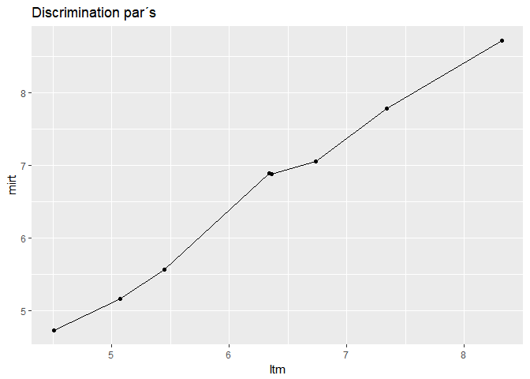

``` r
qplot(x=disc.mirt, y=disc.mirtw, main="Discrimination par´s", xlab="No survey weights", ylab="Using survey weights") + geom_line()
```

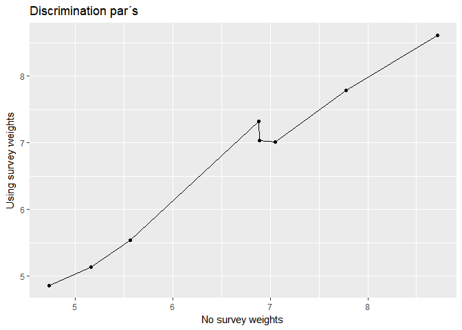

#### Aalysis with weights

``` r
fit.rasch.final <- mirt(items2, model=1, itemtype='Rasch', survey.weights = dat$weighth)
```

    ## 
    Iteration: 1, Log-Lik: -223177057.832, Max-Change: 0.63274
    Iteration: 2, Log-Lik: -211801641.681, Max-Change: 0.47370
    Iteration: 3, Log-Lik: -202384014.496, Max-Change: 0.56086
    Iteration: 4, Log-Lik: -195815915.894, Max-Change: 1.09756
    Iteration: 5, Log-Lik: -184340176.800, Max-Change: 0.76683
    Iteration: 6, Log-Lik: -181207949.621, Max-Change: 0.56382
    Iteration: 7, Log-Lik: -179563133.317, Max-Change: 0.40391
    Iteration: 8, Log-Lik: -178580473.402, Max-Change: 0.28229
    Iteration: 9, Log-Lik: -177972175.985, Max-Change: 0.19541
    Iteration: 10, Log-Lik: -177589622.197, Max-Change: 0.13554
    Iteration: 11, Log-Lik: -177345531.990, Max-Change: 0.09468
    Iteration: 12, Log-Lik: -177187179.699, Max-Change: 0.06672
    Iteration: 13, Log-Lik: -177082553.821, Max-Change: 0.04739
    Iteration: 14, Log-Lik: -177012167.385, Max-Change: 0.03388
    Iteration: 15, Log-Lik: -176964022.519, Max-Change: 0.02430
    Iteration: 16, Log-Lik: -176930666.795, Max-Change: 0.01739
    Iteration: 17, Log-Lik: -176907406.235, Max-Change: 0.01260
    Iteration: 18, Log-Lik: -176890898.444, Max-Change: 0.00910
    Iteration: 19, Log-Lik: -176879151.942, Max-Change: 0.00647
    Iteration: 20, Log-Lik: -176870895.567, Max-Change: 0.00475
    Iteration: 21, Log-Lik: -176864881.058, Max-Change: 0.00345
    Iteration: 22, Log-Lik: -176860540.128, Max-Change: 0.00250
    Iteration: 23, Log-Lik: -176857409.777, Max-Change: 0.00173
    Iteration: 24, Log-Lik: -176855248.369, Max-Change: 0.00070
    Iteration: 25, Log-Lik: -176854373.233, Max-Change: 0.00077
    Iteration: 26, Log-Lik: -176853417.981, Max-Change: 0.00073
    Iteration: 27, Log-Lik: -176852505.851, Max-Change: 0.00037
    Iteration: 28, Log-Lik: -176852045.521, Max-Change: 0.00053
    Iteration: 29, Log-Lik: -176851392.130, Max-Change: 0.00041
    Iteration: 30, Log-Lik: -176850882.778, Max-Change: 0.00026
    Iteration: 31, Log-Lik: -176850559.965, Max-Change: 0.00016
    Iteration: 32, Log-Lik: -176850374.723, Max-Change: 0.00017
    Iteration: 33, Log-Lik: -176850158.039, Max-Change: 0.00010
    Iteration: 34, Log-Lik: -176850028.142, Max-Change: 0.00011
    Iteration: 35, Log-Lik: -176849885.935, Max-Change: 0.00007

``` r
fit.2pl.final <- mirt(items2, model=1, itemtype='2PL', survey.weights = dat$weighth)
```

    ## 
    Iteration: 1, Log-Lik: -232882206.708, Max-Change: 2.85438
    Iteration: 2, Log-Lik: -177518181.027, Max-Change: 2.06446
    Iteration: 3, Log-Lik: -163262118.808, Max-Change: 2.71548
    Iteration: 4, Log-Lik: -159127884.256, Max-Change: 0.59816
    Iteration: 5, Log-Lik: -157700070.772, Max-Change: 0.93832
    Iteration: 6, Log-Lik: -157135576.288, Max-Change: 0.65905
    Iteration: 7, Log-Lik: -156773380.104, Max-Change: 0.61091
    Iteration: 8, Log-Lik: -156491515.774, Max-Change: 0.25478
    Iteration: 9, Log-Lik: -156314200.306, Max-Change: 0.15361
    Iteration: 10, Log-Lik: -156187826.275, Max-Change: 0.21287
    Iteration: 11, Log-Lik: -156083725.573, Max-Change: 0.18213
    Iteration: 12, Log-Lik: -155992579.911, Max-Change: 0.10763
    Iteration: 13, Log-Lik: -155921070.535, Max-Change: 0.08913
    Iteration: 14, Log-Lik: -155861310.925, Max-Change: 0.07457
    Iteration: 15, Log-Lik: -155811250.020, Max-Change: 0.06319
    Iteration: 16, Log-Lik: -155768180.570, Max-Change: 0.05495
    Iteration: 17, Log-Lik: -155730845.920, Max-Change: 0.04844
    Iteration: 18, Log-Lik: -155698337.960, Max-Change: 0.04012
    Iteration: 19, Log-Lik: -155669665.460, Max-Change: 0.04262
    Iteration: 20, Log-Lik: -155644442.420, Max-Change: 0.04142
    Iteration: 21, Log-Lik: -155622390.330, Max-Change: 0.03043
    Iteration: 22, Log-Lik: -155603123.857, Max-Change: 0.02671
    Iteration: 23, Log-Lik: -155586224.500, Max-Change: 0.02411
    Iteration: 24, Log-Lik: -155571355.753, Max-Change: 0.02573
    Iteration: 25, Log-Lik: -155558262.417, Max-Change: 0.02136
    Iteration: 26, Log-Lik: -155546766.941, Max-Change: 0.02000
    Iteration: 27, Log-Lik: -155536583.995, Max-Change: 0.02208
    Iteration: 28, Log-Lik: -155527548.985, Max-Change: 0.01475
    Iteration: 29, Log-Lik: -155519593.640, Max-Change: 0.01441
    Iteration: 30, Log-Lik: -155512528.460, Max-Change: 0.01395
    Iteration: 31, Log-Lik: -155506268.205, Max-Change: 0.01341
    Iteration: 32, Log-Lik: -155500723.354, Max-Change: 0.01283
    Iteration: 33, Log-Lik: -155495812.138, Max-Change: 0.01225
    Iteration: 34, Log-Lik: -155491459.657, Max-Change: 0.01160
    Iteration: 35, Log-Lik: -155487563.799, Max-Change: 0.01106
    Iteration: 36, Log-Lik: -155484103.666, Max-Change: 0.01057
    Iteration: 37, Log-Lik: -155481030.486, Max-Change: 0.00749
    Iteration: 38, Log-Lik: -155478360.470, Max-Change: 0.01325
    Iteration: 39, Log-Lik: -155475925.007, Max-Change: 0.00630
    Iteration: 40, Log-Lik: -155473784.009, Max-Change: 0.00793
    Iteration: 41, Log-Lik: -155471889.287, Max-Change: 0.01145
    Iteration: 42, Log-Lik: -155470162.676, Max-Change: 0.00537
    Iteration: 43, Log-Lik: -155468653.903, Max-Change: 0.00640
    Iteration: 44, Log-Lik: -155467300.271, Max-Change: 0.01070
    Iteration: 45, Log-Lik: -155466085.646, Max-Change: 0.00442
    Iteration: 46, Log-Lik: -155465022.067, Max-Change: 0.00546
    Iteration: 47, Log-Lik: -155464065.321, Max-Change: 0.00418
    Iteration: 48, Log-Lik: -155463223.674, Max-Change: 0.00530
    Iteration: 49, Log-Lik: -155462462.723, Max-Change: 0.00381
    Iteration: 50, Log-Lik: -155461795.407, Max-Change: 0.00353
    Iteration: 51, Log-Lik: -155461211.394, Max-Change: 0.00588
    Iteration: 52, Log-Lik: -155460667.048, Max-Change: 0.00321
    Iteration: 53, Log-Lik: -155460204.390, Max-Change: 0.00281
    Iteration: 54, Log-Lik: -155459786.447, Max-Change: 0.00268
    Iteration: 55, Log-Lik: -155459413.815, Max-Change: 0.00254
    Iteration: 56, Log-Lik: -155459082.133, Max-Change: 0.00241
    Iteration: 57, Log-Lik: -155458786.951, Max-Change: 0.00229
    Iteration: 58, Log-Lik: -155458524.173, Max-Change: 0.00217
    Iteration: 59, Log-Lik: -155458290.154, Max-Change: 0.00205
    Iteration: 60, Log-Lik: -155458081.661, Max-Change: 0.00216
    Iteration: 61, Log-Lik: -155457897.257, Max-Change: 0.00206
    Iteration: 62, Log-Lik: -155457727.123, Max-Change: 0.00541
    Iteration: 63, Log-Lik: -155457554.438, Max-Change: 0.00198
    Iteration: 64, Log-Lik: -155457423.143, Max-Change: 0.00178
    Iteration: 65, Log-Lik: -155457301.808, Max-Change: 0.00171
    Iteration: 66, Log-Lik: -155457191.391, Max-Change: 0.01138
    Iteration: 67, Log-Lik: -155457051.929, Max-Change: 0.00171
    Iteration: 68, Log-Lik: -155456966.051, Max-Change: 0.00126
    Iteration: 69, Log-Lik: -155456888.477, Max-Change: 0.00141
    Iteration: 70, Log-Lik: -155456819.916, Max-Change: 0.00106
    Iteration: 71, Log-Lik: -155456759.711, Max-Change: 0.00130
    Iteration: 72, Log-Lik: -155456703.020, Max-Change: 0.00095
    Iteration: 73, Log-Lik: -155456655.143, Max-Change: 0.00119
    Iteration: 74, Log-Lik: -155456609.895, Max-Change: 0.00086
    Iteration: 75, Log-Lik: -155456571.948, Max-Change: 0.00085
    Iteration: 76, Log-Lik: -155456537.117, Max-Change: 0.00080
    Iteration: 77, Log-Lik: -155456506.493, Max-Change: 0.00075
    Iteration: 78, Log-Lik: -155456479.266, Max-Change: 0.00072
    Iteration: 79, Log-Lik: -155456454.989, Max-Change: 0.00068
    Iteration: 80, Log-Lik: -155456433.237, Max-Change: 0.00064
    Iteration: 81, Log-Lik: -155456413.835, Max-Change: 0.00063
    Iteration: 82, Log-Lik: -155456396.489, Max-Change: 0.00060
    Iteration: 83, Log-Lik: -155456380.635, Max-Change: 0.00057
    Iteration: 84, Log-Lik: -155456366.502, Max-Change: 0.00054
    Iteration: 85, Log-Lik: -155456353.866, Max-Change: 0.00051
    Iteration: 86, Log-Lik: -155456342.562, Max-Change: 0.00049
    Iteration: 87, Log-Lik: -155456332.439, Max-Change: 0.00046
    Iteration: 88, Log-Lik: -155456323.363, Max-Change: 0.00044
    Iteration: 89, Log-Lik: -155456315.215, Max-Change: 0.00042
    Iteration: 90, Log-Lik: -155456307.891, Max-Change: 0.00046
    Iteration: 91, Log-Lik: -155456301.322, Max-Change: 0.00042
    Iteration: 92, Log-Lik: -155456294.924, Max-Change: 0.00041
    Iteration: 93, Log-Lik: -155456289.068, Max-Change: 0.00039
    Iteration: 94, Log-Lik: -155456283.773, Max-Change: 0.00037
    Iteration: 95, Log-Lik: -155456278.977, Max-Change: 0.00036
    Iteration: 96, Log-Lik: -155456274.626, Max-Change: 0.00035
    Iteration: 97, Log-Lik: -155456253.696, Max-Change: 0.00025
    Iteration: 98, Log-Lik: -155456252.254, Max-Change: 0.00016
    Iteration: 99, Log-Lik: -155456251.050, Max-Change: 0.00014
    Iteration: 100, Log-Lik: -155456247.638, Max-Change: 0.00013
    Iteration: 101, Log-Lik: -155456246.758, Max-Change: 0.00012
    Iteration: 102, Log-Lik: -155456245.956, Max-Change: 0.00012
    Iteration: 103, Log-Lik: -155456241.937, Max-Change: 0.00012
    Iteration: 104, Log-Lik: -155456241.387, Max-Change: 0.00050
    Iteration: 105, Log-Lik: -155456239.096, Max-Change: 0.00018
    Iteration: 106, Log-Lik: -155456238.908, Max-Change: 0.00013
    Iteration: 107, Log-Lik: -155456238.460, Max-Change: 0.00044
    Iteration: 108, Log-Lik: -155456236.750, Max-Change: 0.00022
    Iteration: 109, Log-Lik: -155456236.489, Max-Change: 0.00014
    Iteration: 110, Log-Lik: -155456236.090, Max-Change: 0.00041
    Iteration: 111, Log-Lik: -155456234.727, Max-Change: 0.00024
    Iteration: 112, Log-Lik: -155456234.396, Max-Change: 0.00014
    Iteration: 113, Log-Lik: -155456234.027, Max-Change: 0.00037
    Iteration: 114, Log-Lik: -155456232.860, Max-Change: 0.00025
    Iteration: 115, Log-Lik: -155456232.495, Max-Change: 0.00013
    Iteration: 116, Log-Lik: -155456232.147, Max-Change: 0.00036
    Iteration: 117, Log-Lik: -155456231.090, Max-Change: 0.00025
    Iteration: 118, Log-Lik: -155456230.720, Max-Change: 0.00013
    Iteration: 119, Log-Lik: -155456230.391, Max-Change: 0.00035
    Iteration: 120, Log-Lik: -155456229.399, Max-Change: 0.00025
    Iteration: 121, Log-Lik: -155456229.039, Max-Change: 0.00012
    Iteration: 122, Log-Lik: -155456228.725, Max-Change: 0.00034
    Iteration: 123, Log-Lik: -155456227.778, Max-Change: 0.00024
    Iteration: 124, Log-Lik: -155456227.433, Max-Change: 0.00012
    Iteration: 125, Log-Lik: -155456227.132, Max-Change: 0.00034
    Iteration: 126, Log-Lik: -155456226.222, Max-Change: 0.00023
    Iteration: 127, Log-Lik: -155456225.892, Max-Change: 0.00012
    Iteration: 128, Log-Lik: -155456225.603, Max-Change: 0.00033
    Iteration: 129, Log-Lik: -155456224.724, Max-Change: 0.00023
    Iteration: 130, Log-Lik: -155456224.409, Max-Change: 0.00011
    Iteration: 131, Log-Lik: -155456224.131, Max-Change: 0.00033
    Iteration: 132, Log-Lik: -155456223.281, Max-Change: 0.00022
    Iteration: 133, Log-Lik: -155456222.980, Max-Change: 0.00011
    Iteration: 134, Log-Lik: -155456222.711, Max-Change: 0.00032
    Iteration: 135, Log-Lik: -155456221.890, Max-Change: 0.00021
    Iteration: 136, Log-Lik: -155456221.600, Max-Change: 0.00011
    Iteration: 137, Log-Lik: -155456221.341, Max-Change: 0.00032
    Iteration: 138, Log-Lik: -155456220.546, Max-Change: 0.00021
    Iteration: 139, Log-Lik: -155456220.267, Max-Change: 0.00010
    Iteration: 140, Log-Lik: -155456220.017, Max-Change: 0.00032
    Iteration: 141, Log-Lik: -155456219.248, Max-Change: 0.00020
    Iteration: 142, Log-Lik: -155456218.979, Max-Change: 0.00010
    Iteration: 143, Log-Lik: -155456218.737, Max-Change: 0.00031
    Iteration: 144, Log-Lik: -155456217.992, Max-Change: 0.00020
    Iteration: 145, Log-Lik: -155456217.733, Max-Change: 0.00010

``` r
anova(fit.rasch.final, fit.2pl.final)  
```

    ## 
    ## Model 1: mirt(data = items2, model = 1, itemtype = "Rasch", survey.weights = dat$weighth)
    ## Model 2: mirt(data = items2, model = 1, itemtype = "2PL", survey.weights = dat$weighth)

    ##         AIC      AICc     SABIC       BIC     logLik       X2  df   p
    ## 1 353699790 353699790 353699913 353699942 -176849886      NaN NaN NaN
    ## 2 310912467 310912467 310912687 310912737 -155456218 42787336   7   0

``` r
#ICC´s
plot(fit.rasch.final, type = 'trace')
```

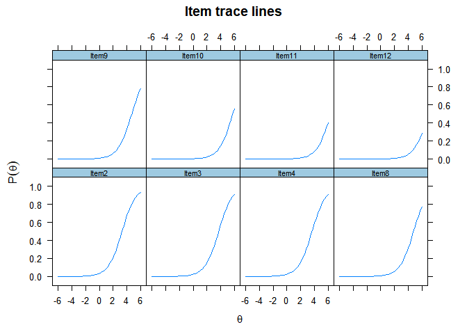

``` r
plot(fit.2pl.final, type = 'trace')
```

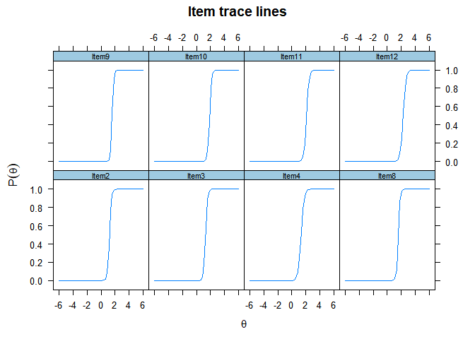
