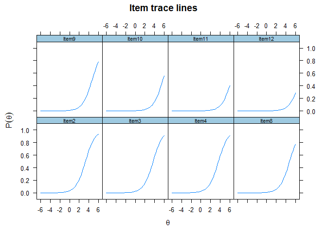
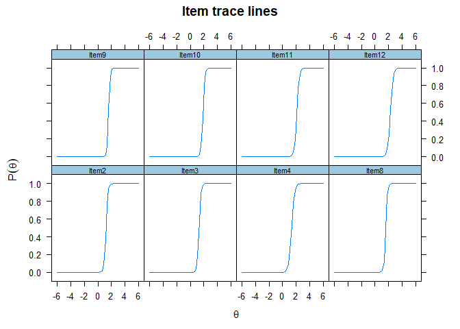
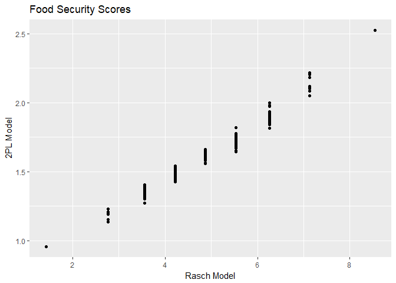

Final models using mirt package
================
Martha Moreno
21 de noviembre de 2017

#### Read data

``` r
dat<-read.dta("data/data_clean_nochild.dta")

items1=cbind(dat$i2, dat$i3, dat$i4, dat$i8, dat$i8a, dat$i9, dat$i10, dat$i11, dat$i12, dat$i12a)
items2=cbind(dat$i2, dat$i3, dat$i4, dat$i8, dat$i9, dat$i10, dat$i11, dat$i12)
nam1<-c("Item2", "Item3", "Item4", "Item8", "Item9", "Item10", "Item11", "Item12")
nam2<-c("No", "Yes", "Total", "Percentage")
colnames(items2)<-nam1

items3 <- data.frame(items2)
index <- sample(1:nrow(items3), 500)
items.sample <- items3[index,]

dat$weight.model = dat$weighth*(51421/157115550)

dat.sample <- dat[index,]
```

``` r
rawscore.8i=rowSums(items2)
  
CrossTable(rawscore.8i,dat$status, expected = F, prop.r=F, prop.c=F, prop.t=F, prop.chisq=F, chisq = F, fisher=F, mcnemar=F, resid=F, sresid=F, asresid=F)
```

    ## 
    ##  
    ##    Cell Contents
    ## |-------------------------|
    ## |                       N |
    ## |-------------------------|
    ## 
    ##  
    ## Total Observations in Table:  51421 
    ## 
    ##  
    ##              | dat$status 
    ##  rawscore.8i |     High Food Security | Marginal Food Security |      Low Food Security | Very Low Food Security |              Row Total | 
    ## -------------|------------------------|------------------------|------------------------|------------------------|------------------------|
    ##            0 |                  43324 |                      0 |                      0 |                      0 |                  43324 | 
    ## -------------|------------------------|------------------------|------------------------|------------------------|------------------------|
    ##            1 |                      0 |                   1996 |                      0 |                      0 |                   1996 | 
    ## -------------|------------------------|------------------------|------------------------|------------------------|------------------------|
    ##            2 |                      0 |                   1410 |                     55 |                      0 |                   1465 | 
    ## -------------|------------------------|------------------------|------------------------|------------------------|------------------------|
    ##            3 |                      0 |                      0 |                   1444 |                      0 |                   1444 | 
    ## -------------|------------------------|------------------------|------------------------|------------------------|------------------------|
    ##            4 |                      0 |                      0 |                    844 |                      5 |                    849 | 
    ## -------------|------------------------|------------------------|------------------------|------------------------|------------------------|
    ##            5 |                      0 |                      0 |                    266 |                    589 |                    855 | 
    ## -------------|------------------------|------------------------|------------------------|------------------------|------------------------|
    ##            6 |                      0 |                      0 |                      0 |                    675 |                    675 | 
    ## -------------|------------------------|------------------------|------------------------|------------------------|------------------------|
    ##            7 |                      0 |                      0 |                      0 |                    495 |                    495 | 
    ## -------------|------------------------|------------------------|------------------------|------------------------|------------------------|
    ##            8 |                      0 |                      0 |                      0 |                    318 |                    318 | 
    ## -------------|------------------------|------------------------|------------------------|------------------------|------------------------|
    ## Column Total |                  43324 |                   3406 |                   2609 |                   2082 |                  51421 | 
    ## -------------|------------------------|------------------------|------------------------|------------------------|------------------------|
    ## 
    ## 

#### Final models using MIRT

``` r
#Rasch model
fit.rasch.final <- mirt(items2, model=1, itemtype='Rasch', survey.weights = dat$weight.model)
```

    ## 
    Iteration: 1, Log-Lik: -73041.704, Max-Change: 0.63274
    Iteration: 2, Log-Lik: -69318.742, Max-Change: 0.47370
    Iteration: 3, Log-Lik: -66236.527, Max-Change: 0.56086
    Iteration: 4, Log-Lik: -64086.911, Max-Change: 1.09756
    Iteration: 5, Log-Lik: -60331.114, Max-Change: 0.76683
    Iteration: 6, Log-Lik: -59305.995, Max-Change: 0.56382
    Iteration: 7, Log-Lik: -58767.677, Max-Change: 0.40391
    Iteration: 8, Log-Lik: -58446.071, Max-Change: 0.28229
    Iteration: 9, Log-Lik: -58246.986, Max-Change: 0.19541
    Iteration: 10, Log-Lik: -58121.783, Max-Change: 0.13554
    Iteration: 11, Log-Lik: -58041.897, Max-Change: 0.09468
    Iteration: 12, Log-Lik: -57990.071, Max-Change: 0.06672
    Iteration: 13, Log-Lik: -57955.829, Max-Change: 0.04739
    Iteration: 14, Log-Lik: -57932.793, Max-Change: 0.03388
    Iteration: 15, Log-Lik: -57917.036, Max-Change: 0.02430
    Iteration: 16, Log-Lik: -57906.120, Max-Change: 0.01739
    Iteration: 17, Log-Lik: -57898.507, Max-Change: 0.01260
    Iteration: 18, Log-Lik: -57893.104, Max-Change: 0.00910
    Iteration: 19, Log-Lik: -57889.260, Max-Change: 0.00647
    Iteration: 20, Log-Lik: -57886.558, Max-Change: 0.00475
    Iteration: 21, Log-Lik: -57884.589, Max-Change: 0.00345
    Iteration: 22, Log-Lik: -57883.153, Max-Change: 0.00384
    Iteration: 23, Log-Lik: -57881.593, Max-Change: 0.00198
    Iteration: 24, Log-Lik: -57880.789, Max-Change: 0.00068
    Iteration: 25, Log-Lik: -57880.511, Max-Change: 0.00031
    Iteration: 26, Log-Lik: -57880.387, Max-Change: 0.00044
    Iteration: 27, Log-Lik: -57880.206, Max-Change: 0.00046
    Iteration: 28, Log-Lik: -57880.018, Max-Change: 0.00025
    Iteration: 29, Log-Lik: -57879.926, Max-Change: 0.00029
    Iteration: 30, Log-Lik: -57879.810, Max-Change: 0.00012
    Iteration: 31, Log-Lik: -57879.760, Max-Change: 0.00022
    Iteration: 32, Log-Lik: -57879.670, Max-Change: 0.00007

``` r
#2PL model
fit.2pl.final <- mirt(items2, model=1, itemtype='2PL', survey.weights = dat$weight.model)
```

    ## 
    Iteration: 1, Log-Lik: -76218.019, Max-Change: 3.62612
    Iteration: 2, Log-Lik: -58242.053, Max-Change: 3.99071
    Iteration: 3, Log-Lik: -53683.016, Max-Change: 2.74533
    Iteration: 4, Log-Lik: -52423.607, Max-Change: 1.40145
    Iteration: 5, Log-Lik: -51932.277, Max-Change: 1.26787
    Iteration: 6, Log-Lik: -51653.701, Max-Change: 0.81399
    Iteration: 7, Log-Lik: -51481.423, Max-Change: 0.46053
    Iteration: 8, Log-Lik: -51366.821, Max-Change: 0.32251
    Iteration: 9, Log-Lik: -51284.117, Max-Change: 0.24816
    Iteration: 10, Log-Lik: -51220.898, Max-Change: 0.20656
    Iteration: 11, Log-Lik: -51174.151, Max-Change: 0.14404
    Iteration: 12, Log-Lik: -51133.089, Max-Change: 0.12942
    Iteration: 13, Log-Lik: -51098.947, Max-Change: 0.09415
    Iteration: 14, Log-Lik: -51072.102, Max-Change: 0.08261
    Iteration: 15, Log-Lik: -51047.325, Max-Change: 0.08599
    Iteration: 16, Log-Lik: -51025.833, Max-Change: 0.08351
    Iteration: 17, Log-Lik: -51007.420, Max-Change: 0.04386
    Iteration: 18, Log-Lik: -50991.848, Max-Change: 0.03970
    Iteration: 19, Log-Lik: -50978.255, Max-Change: 0.03637
    Iteration: 20, Log-Lik: -50966.377, Max-Change: 0.03446
    Iteration: 21, Log-Lik: -50955.980, Max-Change: 0.02957
    Iteration: 22, Log-Lik: -50946.849, Max-Change: 0.03362
    Iteration: 23, Log-Lik: -50938.812, Max-Change: 0.02574
    Iteration: 24, Log-Lik: -50931.834, Max-Change: 0.02862
    Iteration: 25, Log-Lik: -50925.620, Max-Change: 0.02288
    Iteration: 26, Log-Lik: -50920.205, Max-Change: 0.02198
    Iteration: 27, Log-Lik: -50915.424, Max-Change: 0.02096
    Iteration: 28, Log-Lik: -50911.198, Max-Change: 0.01992
    Iteration: 29, Log-Lik: -50907.460, Max-Change: 0.01890
    Iteration: 30, Log-Lik: -50904.152, Max-Change: 0.01790
    Iteration: 31, Log-Lik: -50889.287, Max-Change: 0.01339
    Iteration: 32, Log-Lik: -50888.031, Max-Change: 0.00794
    Iteration: 33, Log-Lik: -50886.936, Max-Change: 0.00767
    Iteration: 34, Log-Lik: -50882.102, Max-Change: 0.01383
    Iteration: 35, Log-Lik: -50881.634, Max-Change: 0.01135
    Iteration: 36, Log-Lik: -50881.223, Max-Change: 0.00640
    Iteration: 37, Log-Lik: -50880.774, Max-Change: 0.01459
    Iteration: 38, Log-Lik: -50880.461, Max-Change: 0.00510
    Iteration: 39, Log-Lik: -50880.186, Max-Change: 0.00390
    Iteration: 40, Log-Lik: -50879.842, Max-Change: 0.00359
    Iteration: 41, Log-Lik: -50879.639, Max-Change: 0.00582
    Iteration: 42, Log-Lik: -50879.453, Max-Change: 0.00333
    Iteration: 43, Log-Lik: -50879.334, Max-Change: 0.00298
    Iteration: 44, Log-Lik: -50879.186, Max-Change: 0.00280
    Iteration: 45, Log-Lik: -50879.055, Max-Change: 0.00261
    Iteration: 46, Log-Lik: -50878.462, Max-Change: 0.00618
    Iteration: 47, Log-Lik: -50878.396, Max-Change: 0.00206
    Iteration: 48, Log-Lik: -50878.349, Max-Change: 0.00185
    Iteration: 49, Log-Lik: -50878.136, Max-Change: 0.00810
    Iteration: 50, Log-Lik: -50878.104, Max-Change: 0.00139
    Iteration: 51, Log-Lik: -50878.085, Max-Change: 0.00102
    Iteration: 52, Log-Lik: -50878.063, Max-Change: 0.00118
    Iteration: 53, Log-Lik: -50878.050, Max-Change: 0.00082
    Iteration: 54, Log-Lik: -50878.039, Max-Change: 0.00082
    Iteration: 55, Log-Lik: -50877.988, Max-Change: 0.00053
    Iteration: 56, Log-Lik: -50877.983, Max-Change: 0.00052
    Iteration: 57, Log-Lik: -50877.979, Max-Change: 0.00050
    Iteration: 58, Log-Lik: -50877.961, Max-Change: 0.00047
    Iteration: 59, Log-Lik: -50877.959, Max-Change: 0.00043
    Iteration: 60, Log-Lik: -50877.957, Max-Change: 0.00041
    Iteration: 61, Log-Lik: -50877.949, Max-Change: 0.00027
    Iteration: 62, Log-Lik: -50877.949, Max-Change: 0.00018
    Iteration: 63, Log-Lik: -50877.948, Max-Change: 0.00016
    Iteration: 64, Log-Lik: -50877.947, Max-Change: 0.00015
    Iteration: 65, Log-Lik: -50877.947, Max-Change: 0.00013
    Iteration: 66, Log-Lik: -50877.946, Max-Change: 0.00013
    Iteration: 67, Log-Lik: -50877.945, Max-Change: 0.00014
    Iteration: 68, Log-Lik: -50877.945, Max-Change: 0.00060
    Iteration: 69, Log-Lik: -50877.944, Max-Change: 0.00023
    Iteration: 70, Log-Lik: -50877.943, Max-Change: 0.00016
    Iteration: 71, Log-Lik: -50877.943, Max-Change: 0.00054
    Iteration: 72, Log-Lik: -50877.943, Max-Change: 0.00030
    Iteration: 73, Log-Lik: -50877.942, Max-Change: 0.00017
    Iteration: 74, Log-Lik: -50877.942, Max-Change: 0.00049
    Iteration: 75, Log-Lik: -50877.942, Max-Change: 0.00034
    Iteration: 76, Log-Lik: -50877.942, Max-Change: 0.00017
    Iteration: 77, Log-Lik: -50877.941, Max-Change: 0.00046
    Iteration: 78, Log-Lik: -50877.941, Max-Change: 0.00035
    Iteration: 79, Log-Lik: -50877.941, Max-Change: 0.00016
    Iteration: 80, Log-Lik: -50877.941, Max-Change: 0.00043
    Iteration: 81, Log-Lik: -50877.940, Max-Change: 0.00034
    Iteration: 82, Log-Lik: -50877.940, Max-Change: 0.00016
    Iteration: 83, Log-Lik: -50877.940, Max-Change: 0.00040
    Iteration: 84, Log-Lik: -50877.939, Max-Change: 0.00033
    Iteration: 85, Log-Lik: -50877.939, Max-Change: 0.00015
    Iteration: 86, Log-Lik: -50877.939, Max-Change: 0.00038
    Iteration: 87, Log-Lik: -50877.939, Max-Change: 0.00032
    Iteration: 88, Log-Lik: -50877.939, Max-Change: 0.00014
    Iteration: 89, Log-Lik: -50877.938, Max-Change: 0.00037
    Iteration: 90, Log-Lik: -50877.938, Max-Change: 0.00031
    Iteration: 91, Log-Lik: -50877.938, Max-Change: 0.00014
    Iteration: 92, Log-Lik: -50877.938, Max-Change: 0.00037
    Iteration: 93, Log-Lik: -50877.937, Max-Change: 0.00030
    Iteration: 94, Log-Lik: -50877.937, Max-Change: 0.00013
    Iteration: 95, Log-Lik: -50877.937, Max-Change: 0.00036
    Iteration: 96, Log-Lik: -50877.937, Max-Change: 0.00029
    Iteration: 97, Log-Lik: -50877.937, Max-Change: 0.00013
    Iteration: 98, Log-Lik: -50877.937, Max-Change: 0.00036
    Iteration: 99, Log-Lik: -50877.936, Max-Change: 0.00029
    Iteration: 100, Log-Lik: -50877.936, Max-Change: 0.00013
    Iteration: 101, Log-Lik: -50877.936, Max-Change: 0.00036
    Iteration: 102, Log-Lik: -50877.936, Max-Change: 0.00028
    Iteration: 103, Log-Lik: -50877.936, Max-Change: 0.00012
    Iteration: 104, Log-Lik: -50877.935, Max-Change: 0.00035
    Iteration: 105, Log-Lik: -50877.935, Max-Change: 0.00027
    Iteration: 106, Log-Lik: -50877.935, Max-Change: 0.00012
    Iteration: 107, Log-Lik: -50877.935, Max-Change: 0.00035
    Iteration: 108, Log-Lik: -50877.935, Max-Change: 0.00027
    Iteration: 109, Log-Lik: -50877.935, Max-Change: 0.00012
    Iteration: 110, Log-Lik: -50877.934, Max-Change: 0.00034
    Iteration: 111, Log-Lik: -50877.934, Max-Change: 0.00026
    Iteration: 112, Log-Lik: -50877.934, Max-Change: 0.00011
    Iteration: 113, Log-Lik: -50877.934, Max-Change: 0.00034
    Iteration: 114, Log-Lik: -50877.934, Max-Change: 0.00026
    Iteration: 115, Log-Lik: -50877.934, Max-Change: 0.00011
    Iteration: 116, Log-Lik: -50877.933, Max-Change: 0.00034
    Iteration: 117, Log-Lik: -50877.933, Max-Change: 0.00025
    Iteration: 118, Log-Lik: -50877.933, Max-Change: 0.00011
    Iteration: 119, Log-Lik: -50877.933, Max-Change: 0.00033
    Iteration: 120, Log-Lik: -50877.933, Max-Change: 0.00025
    Iteration: 121, Log-Lik: -50877.933, Max-Change: 0.00011
    Iteration: 122, Log-Lik: -50877.933, Max-Change: 0.00033
    Iteration: 123, Log-Lik: -50877.932, Max-Change: 0.00024
    Iteration: 124, Log-Lik: -50877.932, Max-Change: 0.00011
    Iteration: 125, Log-Lik: -50877.932, Max-Change: 0.00033
    Iteration: 126, Log-Lik: -50877.932, Max-Change: 0.00024
    Iteration: 127, Log-Lik: -50877.932, Max-Change: 0.00010
    Iteration: 128, Log-Lik: -50877.932, Max-Change: 0.00032
    Iteration: 129, Log-Lik: -50877.931, Max-Change: 0.00023
    Iteration: 130, Log-Lik: -50877.931, Max-Change: 0.00010
    Iteration: 131, Log-Lik: -50877.931, Max-Change: 0.00032
    Iteration: 132, Log-Lik: -50877.931, Max-Change: 0.00023
    Iteration: 133, Log-Lik: -50877.931, Max-Change: 0.00010

``` r
#Fit and coefficients of Rasch 
fit.rasch.final
```

    ## 
    ## Call:
    ## mirt(data = items2, model = 1, itemtype = "Rasch", survey.weights = dat$weight.model)
    ## 
    ## Full-information item factor analysis with 1 factor(s).
    ## Converged within 1e-04 tolerance after 32 EM iterations.
    ## mirt version: 1.25 
    ## M-step optimizer: L-BFGS-B 
    ## EM acceleration: Ramsay 
    ## Number of rectangular quadrature: 61
    ## 
    ## Log-likelihood = -57879.67
    ## Estimated parameters: 9 
    ## AIC = 115777.3; AICc = 115777.3
    ## BIC = 115857; SABIC = 115828.4
    ## G2 (246) = 16399.43, p = 0
    ## RMSEA = 0.036, CFI = NaN, TLI = NaN

``` r
coef(fit.rasch.final,simplify=T)
```

    ## $items
    ##        a1      d g u
    ## Item2   1 -3.310 0 1
    ## Item3   1 -3.726 0 1
    ## Item4   1 -3.675 0 1
    ## Item8   1 -4.805 0 1
    ## Item9   1 -4.721 0 1
    ## Item10  1 -5.787 0 1
    ## Item11  1 -6.388 0 1
    ## Item12  1 -6.932 0 1
    ## 
    ## $means
    ## F1 
    ##  0 
    ## 
    ## $cov
    ##       F1
    ## F1 6.168

``` r
#Fit and coefficients of 2PL
fit.2pl.final
```

    ## 
    ## Call:
    ## mirt(data = items2, model = 1, itemtype = "2PL", survey.weights = dat$weight.model)
    ## 
    ## Full-information item factor analysis with 1 factor(s).
    ## Converged within 1e-04 tolerance after 133 EM iterations.
    ## mirt version: 1.25 
    ## M-step optimizer: BFGS 
    ## EM acceleration: Ramsay 
    ## Number of rectangular quadrature: 61
    ## 
    ## Log-likelihood = -50877.93
    ## Estimated parameters: 16 
    ## AIC = 101787.9; AICc = 101787.9
    ## BIC = 101929.4; SABIC = 101878.6
    ## G2 (239) = 2395.96, p = 0
    ## RMSEA = 0.013, CFI = NaN, TLI = NaN

``` r
coef(fit.2pl.final,simplify=T)
```

    ## $items
    ##           a1       d g u
    ## Item2  7.032  -8.326 0 1
    ## Item3  7.323  -9.564 0 1
    ## Item4  4.856  -6.448 0 1
    ## Item8  7.790 -12.485 0 1
    ## Item9  8.617 -13.558 0 1
    ## Item10 7.010 -13.220 0 1
    ## Item11 5.536 -11.657 0 1
    ## Item12 5.134 -11.788 0 1
    ## 
    ## $means
    ## F1 
    ##  0 
    ## 
    ## $cov
    ##    F1
    ## F1  1

``` r
#Anova
anova(fit.rasch.final, fit.2pl.final)  
```

    ## 
    ## Model 1: mirt(data = items2, model = 1, itemtype = "Rasch", survey.weights = dat$weight.model)
    ## Model 2: mirt(data = items2, model = 1, itemtype = "2PL", survey.weights = dat$weight.model)

    ##        AIC     AICc    SABIC      BIC    logLik       X2  df   p
    ## 1 115777.3 115777.3 115828.4 115857.0 -57879.67      NaN NaN NaN
    ## 2 101787.9 101787.9 101878.6 101929.4 -50877.93 14003.48   7   0

``` r
#ICC? -- try to do this graph?
plot(fit.rasch.final, type = 'trace')
```



``` r
plot(fit.2pl.final, type = 'trace')
```



#### We take a subsample of 500 to get the chi-square since we are overpowered.

If the *χ*<sup>2</sup> diff-value is significant, the "larger" model with more freely estimated parameters fits the data better than the "smaller" model in which the parameters in question are fixed. So it "pays off" to estimate the additional parameters and to prefer the "larger" model. In case the *χ*<sup>2</sup> diff-value is insignificant, both models fit equally well statistically, so the parameters in question can be eliminated from the model (fixed to zero) and the "smaller" model can be accepted just as well

``` r
fit.rasch.sample <- mirt(items.sample, model=1, itemtype='Rasch', survey.weights = dat.sample$weight.model)
```

    ## 
    Iteration: 1, Log-Lik: -659.946, Max-Change: 0.59892
    Iteration: 2, Log-Lik: -628.324, Max-Change: 0.43255
    Iteration: 3, Log-Lik: -603.074, Max-Change: 0.50926
    Iteration: 4, Log-Lik: -585.122, Max-Change: 1.00471
    Iteration: 5, Log-Lik: -552.397, Max-Change: 0.72208
    Iteration: 6, Log-Lik: -542.751, Max-Change: 0.55593
    Iteration: 7, Log-Lik: -537.320, Max-Change: 0.42058
    Iteration: 8, Log-Lik: -533.891, Max-Change: 0.31040
    Iteration: 9, Log-Lik: -531.675, Max-Change: 0.22529
    Iteration: 10, Log-Lik: -529.858, Max-Change: 0.23983
    Iteration: 11, Log-Lik: -528.736, Max-Change: 0.12879
    Iteration: 12, Log-Lik: -528.180, Max-Change: 0.07472
    Iteration: 13, Log-Lik: -527.859, Max-Change: 0.05084
    Iteration: 14, Log-Lik: -527.654, Max-Change: 0.03085
    Iteration: 15, Log-Lik: -527.530, Max-Change: 0.02010
    Iteration: 16, Log-Lik: -527.449, Max-Change: 0.01830
    Iteration: 17, Log-Lik: -527.379, Max-Change: 0.01020
    Iteration: 18, Log-Lik: -527.340, Max-Change: 0.00618
    Iteration: 19, Log-Lik: -527.317, Max-Change: 0.00490
    Iteration: 20, Log-Lik: -527.298, Max-Change: 0.00282
    Iteration: 21, Log-Lik: -527.288, Max-Change: 0.00177
    Iteration: 22, Log-Lik: -527.281, Max-Change: 0.00110
    Iteration: 23, Log-Lik: -527.277, Max-Change: 0.00091
    Iteration: 24, Log-Lik: -527.274, Max-Change: 0.00036
    Iteration: 25, Log-Lik: -527.272, Max-Change: 0.00046
    Iteration: 26, Log-Lik: -527.270, Max-Change: 0.00040
    Iteration: 27, Log-Lik: -527.269, Max-Change: 0.00027
    Iteration: 28, Log-Lik: -527.268, Max-Change: 0.00014
    Iteration: 29, Log-Lik: -527.268, Max-Change: 0.00016
    Iteration: 30, Log-Lik: -527.267, Max-Change: 0.00008

``` r
fit.2pl.sample <- mirt(items.sample, model=1, itemtype='2PL', survey.weights = dat.sample$weight.model)
```

    ## 
    Iteration: 1, Log-Lik: -687.325, Max-Change: 2.95146
    Iteration: 2, Log-Lik: -530.837, Max-Change: 2.05029
    Iteration: 3, Log-Lik: -494.705, Max-Change: 1.69160
    Iteration: 4, Log-Lik: -482.996, Max-Change: 1.29219
    Iteration: 5, Log-Lik: -477.858, Max-Change: 0.89828
    Iteration: 6, Log-Lik: -475.180, Max-Change: 0.70901
    Iteration: 7, Log-Lik: -471.140, Max-Change: 0.06470
    Iteration: 8, Log-Lik: -470.809, Max-Change: 0.07814
    Iteration: 9, Log-Lik: -470.531, Max-Change: 0.06875
    Iteration: 10, Log-Lik: -469.724, Max-Change: 0.05760
    Iteration: 11, Log-Lik: -469.600, Max-Change: 0.05428
    Iteration: 12, Log-Lik: -469.492, Max-Change: 0.05075
    Iteration: 13, Log-Lik: -469.035, Max-Change: 0.03455
    Iteration: 14, Log-Lik: -469.002, Max-Change: 0.02891
    Iteration: 15, Log-Lik: -468.973, Max-Change: 0.02661
    Iteration: 16, Log-Lik: -468.848, Max-Change: 0.01084
    Iteration: 17, Log-Lik: -468.839, Max-Change: 0.01047
    Iteration: 18, Log-Lik: -468.831, Max-Change: 0.01019
    Iteration: 19, Log-Lik: -468.796, Max-Change: 0.00530
    Iteration: 20, Log-Lik: -468.793, Max-Change: 0.00501
    Iteration: 21, Log-Lik: -468.791, Max-Change: 0.00479
    Iteration: 22, Log-Lik: -468.781, Max-Change: 0.00247
    Iteration: 23, Log-Lik: -468.781, Max-Change: 0.00233
    Iteration: 24, Log-Lik: -468.780, Max-Change: 0.00222
    Iteration: 25, Log-Lik: -468.777, Max-Change: 0.00155
    Iteration: 26, Log-Lik: -468.777, Max-Change: 0.00208
    Iteration: 27, Log-Lik: -468.776, Max-Change: 0.00140
    Iteration: 28, Log-Lik: -468.776, Max-Change: 0.01674
    Iteration: 29, Log-Lik: -468.776, Max-Change: 0.00143
    Iteration: 30, Log-Lik: -468.776, Max-Change: 0.00147
    Iteration: 31, Log-Lik: -468.776, Max-Change: 0.00118
    Iteration: 32, Log-Lik: -468.775, Max-Change: 0.00132
    Iteration: 33, Log-Lik: -468.775, Max-Change: 0.00094
    Iteration: 34, Log-Lik: -468.775, Max-Change: 0.00120
    Iteration: 35, Log-Lik: -468.775, Max-Change: 0.00081
    Iteration: 36, Log-Lik: -468.775, Max-Change: 0.00090
    Iteration: 37, Log-Lik: -468.775, Max-Change: 0.00069
    Iteration: 38, Log-Lik: -468.775, Max-Change: 0.00067
    Iteration: 39, Log-Lik: -468.775, Max-Change: 0.00060
    Iteration: 40, Log-Lik: -468.775, Max-Change: 0.00034
    Iteration: 41, Log-Lik: -468.775, Max-Change: 0.00043
    Iteration: 42, Log-Lik: -468.775, Max-Change: 0.00023
    Iteration: 43, Log-Lik: -468.775, Max-Change: 0.00022
    Iteration: 44, Log-Lik: -468.775, Max-Change: 0.00022
    Iteration: 45, Log-Lik: -468.775, Max-Change: 0.00020
    Iteration: 46, Log-Lik: -468.775, Max-Change: 0.00020
    Iteration: 47, Log-Lik: -468.775, Max-Change: 0.00020
    Iteration: 48, Log-Lik: -468.775, Max-Change: 0.00017
    Iteration: 49, Log-Lik: -468.775, Max-Change: 0.00015
    Iteration: 50, Log-Lik: -468.775, Max-Change: 0.00015
    Iteration: 51, Log-Lik: -468.775, Max-Change: 0.00013
    Iteration: 52, Log-Lik: -468.775, Max-Change: 0.00015
    Iteration: 53, Log-Lik: -468.775, Max-Change: 0.00013
    Iteration: 54, Log-Lik: -468.775, Max-Change: 0.00013
    Iteration: 55, Log-Lik: -468.775, Max-Change: 0.00012
    Iteration: 56, Log-Lik: -468.775, Max-Change: 0.00012
    Iteration: 57, Log-Lik: -468.775, Max-Change: 0.00010
    Iteration: 58, Log-Lik: -468.775, Max-Change: 0.00012
    Iteration: 59, Log-Lik: -468.775, Max-Change: 0.00009

``` r
fit.rasch.sample
```

    ## 
    ## Call:
    ## mirt(data = items.sample, model = 1, itemtype = "Rasch", survey.weights = dat.sample$weight.model)
    ## 
    ## Full-information item factor analysis with 1 factor(s).
    ## Converged within 1e-04 tolerance after 30 EM iterations.
    ## mirt version: 1.25 
    ## M-step optimizer: L-BFGS-B 
    ## EM acceleration: Ramsay 
    ## Number of rectangular quadrature: 61
    ## 
    ## Log-likelihood = -527.267
    ## Estimated parameters: 9 
    ## AIC = 1072.534; AICc = 1072.916
    ## BIC = 1110.115; SABIC = 1081.55
    ## G2 (246) = 206.46, p = 0.9684
    ## RMSEA = 0, CFI = NaN, TLI = NaN

``` r
coef(fit.rasch.sample,simplify=T)
```

    ## $items
    ##        a1      d g u
    ## Item2   1 -3.448 0 1
    ## Item3   1 -3.862 0 1
    ## Item4   1 -3.669 0 1
    ## Item8   1 -5.073 0 1
    ## Item9   1 -4.793 0 1
    ## Item10  1 -6.489 0 1
    ## Item11  1 -6.299 0 1
    ## Item12  1 -6.627 0 1
    ## 
    ## $means
    ## F1 
    ##  0 
    ## 
    ## $cov
    ##       F1
    ## F1 6.104

``` r
fit.2pl.sample
```

    ## 
    ## Call:
    ## mirt(data = items.sample, model = 1, itemtype = "2PL", survey.weights = dat.sample$weight.model)
    ## 
    ## Full-information item factor analysis with 1 factor(s).
    ## Converged within 1e-04 tolerance after 59 EM iterations.
    ## mirt version: 1.25 
    ## M-step optimizer: BFGS 
    ## EM acceleration: Ramsay 
    ## Number of rectangular quadrature: 61
    ## 
    ## Log-likelihood = -468.7747
    ## Estimated parameters: 16 
    ## AIC = 969.5493; AICc = 970.722
    ## BIC = 1036.361; SABIC = 985.5782
    ## G2 (239) = 89.47, p = 1
    ## RMSEA = 0, CFI = NaN, TLI = NaN

``` r
coef(fit.2pl.sample,simplify=T)
```

    ## $items
    ##           a1       d g u
    ## Item2  8.775 -10.634 0 1
    ## Item3  9.622 -12.813 0 1
    ## Item4  4.409  -5.902 0 1
    ## Item8  5.440  -9.371 0 1
    ## Item9  6.778 -10.937 0 1
    ## Item10 5.356 -11.556 0 1
    ## Item11 4.485  -9.629 0 1
    ## Item12 4.490 -10.118 0 1
    ## 
    ## $means
    ## F1 
    ##  0 
    ## 
    ## $cov
    ##    F1
    ## F1  1

``` r
anova(fit.rasch.sample, fit.2pl.sample)  
```

    ## 
    ## Model 1: mirt(data = items.sample, model = 1, itemtype = "Rasch", survey.weights = dat.sample$weight.model)
    ## Model 2: mirt(data = items.sample, model = 1, itemtype = "2PL", survey.weights = dat.sample$weight.model)

    ##        AIC     AICc    SABIC      BIC   logLik      X2  df   p
    ## 1 1072.534 1072.916 1081.550 1110.115 -527.267     NaN NaN NaN
    ## 2  969.549  970.722  985.578 1036.361 -468.775 116.985   7   0

#### Predicting scores from the Rasch and 2PL models

In this part we use maximum-likelihood and weighted likelihood estimation of the ability scores.

``` r
f1 <- fscores(fit.rasch.final, method='ML')
f2 <- fscores(fit.2pl.final, method='ML')
f3 <- fscores(fit.rasch.final, method='WLE')
f4 <- fscores(fit.2pl.final, method='WLE')

qplot(x=f3,y=f4, main='Food Security Scores', xlab='Rasch Model', ylab='2PL Model')
```



#### Kolmogorov Smirnov Test

Null hypothesis is that both samples are drawn from the same distribution. As we can see, we reject the null, so there is no evidence to support that both scores are interchangeable??

``` r
ks.test(f3, f4)
```

    ## Warning in ks.test(f3, f4): p-value will be approximate in the presence of
    ## ties

    ## 
    ##  Two-sample Kolmogorov-Smirnov test
    ## 
    ## data:  f3 and f4
    ## D = 0.90988, p-value < 2.2e-16
    ## alternative hypothesis: two-sided

#### Classification
