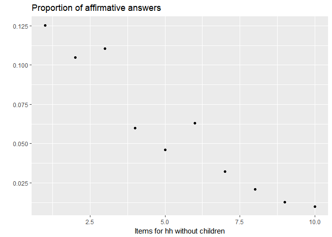
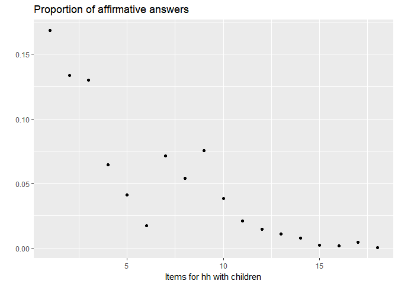
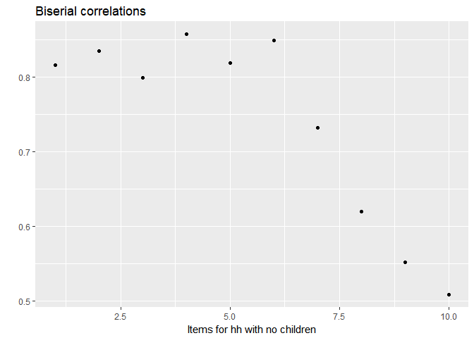
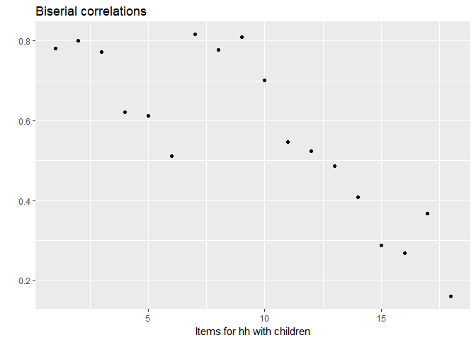

Untitled
================
Martha Moreno
4 de octubre de 2017

screening question - not used for food security measure

q1=hess1

stage 1
-------

q2=hess2

q3=hess3

q4=hess4

if there are children &lt;18 ask q5 and q6

q5=hess5

q6=hess6

1st-level Screen (screener for Stage 2): If AFFIRMATIVE RESPONSE to ANY ONE of Questions 2-6 (i.e., "often true" or "sometimes true") OR response \[3\] or \[4\] to Question 1 (if administered), then continue to Stage 2; otherwise, skip to end.

stage 2
-------

q7=hesh1

q8=hesh2

q8a=heshf2

q9=hesh3

q10=hesh4

q11=hesh5

2nd-level Screen (screener for Stage 3): If AFFIRMATIVE RESPONSE to ANY ONE of Questions 7 through 11, then continue to Stage 3; otherwise, skip to end.

stage 3
-------

q12=hessh1

q12a=hesshf1

q13=hessh2

q14=hessh4

q14a=hesshf4

q15=hessh3

q16=hessh5

``` r
dat1<-read.dta("data/data_clean.dta")

index=(dat1$id_child==0)
index=(index==T)
dat2=dat1[index,]

#Questions for hh with children:
#i5 i6 i7 i13 i14 i14a i15 i16
dat.nochil=cbind(dat2$i2, dat2$i3, dat2$i4, dat2$i8, dat2$i8a, dat2$i9, dat2$i10, dat2$i11, dat2$i12, dat2$i12a)
dat.chil=cbind(dat1$i2, dat1$i3, dat1$i4, dat1$i5, dat1$i6, dat1$i7, dat1$i8, dat1$i8a, dat1$i9, dat1$i10, dat1$i11, dat1$i12, dat1$i12a, dat1$i13, dat1$i14, dat1$i14a, dat1$i15, dat1$i16)

apply(dat.nochil,2,table)
```

    ##    [,1]  [,2]  [,3]  [,4]  [,5]  [,6]  [,7]  [,8]  [,9] [,10]
    ## 0 45035 46084 45789 48405 49112 48237 49822 50416 50824 50976
    ## 1  6452  5403  5698  3082  2375  3250  1665  1071   663   511

``` r
apply(dat.chil,2,table)
```

    ##    [,1]  [,2]  [,3]  [,4]  [,5]  [,6]  [,7]  [,8]  [,9] [,10] [,11] [,12]
    ## 0 83059 86530 86923 93446 95759 98131 92763 94500 92318 96054 97759 98425
    ## 1 16826 13355 12962  6439  4126  1754  7122  5385  7567  3831  2126  1460
    ##   [,13] [,14] [,15] [,16] [,17] [,18]
    ## 0 98766 99080 99632 99685 99403 99832
    ## 1  1119   805   253   200   482    53

``` r
prop.nochil<-apply(dat.nochil,2,mean)
prop.chil<-apply(dat.chil,2,mean)

prop.nochil
```

    ##  [1] 0.125313186 0.104939111 0.110668712 0.059859770 0.046128149
    ##  [6] 0.063122730 0.032338260 0.020801367 0.012877037 0.009924835

``` r
qplot(x=1:length(prop.nochil), y=prop.nochil, main="Proportion of affirmative answers", xlab="Items for hh without children", ylab="")
```



``` r
prop.chil
```

    ##  [1] 0.1684537218 0.1337037593 0.1297692346 0.0644641338 0.0413075036
    ##  [6] 0.0175601942 0.0713019973 0.0539119988 0.0757571207 0.0383541072
    ## [11] 0.0212844771 0.0146168093 0.0112028833 0.0080592682 0.0025329128
    ## [16] 0.0020023026 0.0048255494 0.0005306102

``` r
qplot(x=1:length(prop.chil), y=prop.chil, main="Proportion of affirmative answers", xlab="Items for hh with children", ylab="")
```



``` r
c2=biserial.cor(dat1$rawscore, dat1$i2, level=2)
c3=biserial.cor(dat1$rawscore, dat1$i3, level=2)
c4=biserial.cor(dat1$rawscore, dat1$i4, level=2)
c5=biserial.cor(dat1$rawscore, dat1$i5, level=2)
c6=biserial.cor(dat1$rawscore, dat1$i6, level=2)
c7=biserial.cor(dat1$rawscore, dat1$i7, level=2)
c8=biserial.cor(dat1$rawscore, dat1$i8, level=2)
c8a=biserial.cor(dat1$rawscore, dat1$i8a, level=2)
c9=biserial.cor(dat1$rawscore, dat1$i9, level=2)
c10=biserial.cor(dat1$rawscore, dat1$i10, level=2)
c11=biserial.cor(dat1$rawscore, dat1$i11, level=2)
c12=biserial.cor(dat1$rawscore, dat1$i12, level=2)
c12a=biserial.cor(dat1$rawscore, dat1$i12a, level=2)
c13=biserial.cor(dat1$rawscore, dat1$i13, level=2)
c14=biserial.cor(dat1$rawscore, dat1$i14, level=2)
c14a=biserial.cor(dat1$rawscore, dat1$i14a, level=2)
c15=biserial.cor(dat1$rawscore, dat1$i15, level=2)
c16=biserial.cor(dat1$rawscore, dat1$i16, level=2)

nc2=biserial.cor(dat2$rawscore, dat2$i2, level=2)
nc3=biserial.cor(dat2$rawscore, dat2$i3, level=2)
nc4=biserial.cor(dat2$rawscore, dat2$i4, level=2)
nc8=biserial.cor(dat2$rawscore, dat2$i8, level=2)
nc8a=biserial.cor(dat2$rawscore, dat2$i8a, level=2)
nc9=biserial.cor(dat2$rawscore, dat2$i9, level=2)
nc10=biserial.cor(dat2$rawscore, dat2$i10, level=2)
nc11=biserial.cor(dat2$rawscore, dat2$i11, level=2)
nc12=biserial.cor(dat2$rawscore, dat2$i12, level=2)
nc12a=biserial.cor(dat2$rawscore, dat2$i12a, level=2)

cor.chil<-c(c2, c3, c4, c5, c6, c7, c8, c8a, c9, c10, c11, c12, c12a, c13, c14, c14a, c15, c16)
cor.nochil=c(nc2, nc3, nc4, nc8, nc8a, nc9, nc10, nc11, nc12, nc12a)


qplot(x=1:length(cor.nochil), y=cor.nochil, main="Biserial correlations", xlab="Items for hh with no children", ylab="")
```



``` r
qplot(x=1:length(cor.chil), y=cor.chil, main="Biserial correlations", xlab="Items for hh with children", ylab="")
```


